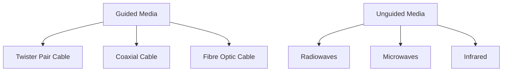

<FloatingButtonContainer>
   <SpoilerReveal></SpoilerReveal>
   <Scrambler></Scrambler>
</FloatingButtonContainer>

# CS 004 (Networks and Communications)

## Prelim

---

### !!Computer Network!!
- An interconnection of computers and computing equipment using either wires or radio waves over small or large geographic areas.

---

### !!LAN (Local Area Network)!!
- Networks that are small in geographic size spanning a room, floor, building, or campus.
- Group of computers connected with each other in small places.
- Secure because there is no outside connection.
- Considerably faster due to their small size.
- Can be wireless.
- Connects a relatively a number of machines in a close geographical area.

---

### !!MAN (Metropolitan Area Network)!!
- Networks that serve an area of 1 to 30 miles, approximately the size of a typical city.
- In MAN, various LAN are connected with each other.
- Size of MANs is larger than LANs but smaller than WANs.

---

### !!WAN (Wide Area Network)!!
- A large network that encompasses parts of states, multiple states, countries, and the world.
- Provides long distance transmission of data.
- Larger than LANs and MANs.

---

### !!PAN (Personal Area Network)!!
- A network of a few meters, between wireless devices such as PDAs, laptops, and similar devices.

---

### !!Voice Network!!
- A network that transmits only telephone signals.
- Almost extinct.

---

### !!Data Network!!
- A network that transmits voice and computer data.
- Replaces !!voice networks!!.

---

### !!Telecommunications!!
- The study of telephones and the systems that transmit telephone signals.

---

### !!Network Management!!
- The design, installation, and support of a network, including its hardware and software.

---

### !!Network Cloud!!
- A network that contains software, applications, or data.
- Either local or remote.
- It's all of the things you can access remotely over the Internet. When something is in the cloud, it means it's stored on Internet servers instead of your computer's hard drive.

---

### Communications Networks - Basic Layouts
- !!LAN-to-LAN!!
  - Found in systems that have 2 or more LANs and a need for them to intercommunicate.
- !!LAN-to-MAN!!
  - Used to interconnect companies.
  - High-speed networks with redundant circuits.
- !!LAN-to-WAN!!
  - One of the most common ways to interconnect a user on a LAN workstation to the Internet (a WAN).
- !!Sensor-to-LAN!!
  - Often found in industrial and laboratory environments.
- !!WAN-to-WAN!!
  - High-speed routers and switches are used to connect one wide area network to another.
- !!PAN-to-workstation!!
  - Interconnects wireless devices such as PDAs laptops and notebooks.
  - Used over short distances such as a few meters.
- !!Satellite and microwave!!
  - Typically long distance wireless connections.
- !!Cellphones!!
  - Constantly expanding market across the world.
- !!Microcomputer-to-LAN!!
  - Highly common throughout business and academic environments
  - Typically medium to high-speed connection
- !!Microcomputer-to-Internet!!
  - Popular with home users and small businesses
- !!Computer terminal / microcomputer-to-mainframe!!
  - Predominant form in the 60s and 70s

---

### !!Network Architectures!!
- A reference model that describes the layers of hardware and software necessary to transmit data between 2 points or for multiple devices / applications to interoperate.
- Has 2 models:
  - !!TCP/IP protocol suite!!
    - A connection oriented protocol and offers end-to-end packet delivery.
  - !!OSI model!!
    - Created by ISO *(!!International Organization for Standardization!!)*

---

### 5 Layers of TCP/IP Protocol Suite
The following are ordered from highest layer to lowest layer:
- !!Layer 1 *(Highest Layer)*: Application Layer!!
  - Where the application using the network resides.
  - Common network applications include web browsing, e-mail, file transfers, and remote logins.
- !!Layer 2: Transport Layer!!
  - Performs a series of miscellaneous functions *(at the end-points of the connection)* necessary for presenting the data package properly to the sender or receiver.
- !!Layer 3: Network *(Internet or Internetwork or IP)* Layer!!
  - Responsible for creating, maintaining and ending network connections.
  - Transfers data packet from node to node within network.
  - Provides an end-to-end logical addressing system so that a packet of data can be routed across several layer.
- !!Layer 4: Network Access *(Data Link)* Layer!!
  - Responsible for taking the data and transforming it into a frame with header, control and address information, and error detection code, then transmitting it between the workstation and the network.
- !!Layer 5 *(Lowest Layer)*: Physical Layer!!
  - Handles the transmission of bits over a communications channel.
  - Includes voltage levels, connectors, media choice, modulation techniques.

---

### 7 Layers of OSI *(!!Open Systems Interconnection!!)* Model
The following are ordered from highest layer to lowest layer:
- !!Layer 1 *(Highest Layer)*: Application Layer!!
  - Equivalent to TCP/IP's !!application!! layer.
- !!Layer 2: Presentation Layer!!
  - Responsible for *"final representation"* of data.
- !!Layer 3: Session Layer!!
  - Responsible for establishing *"sessions"* between users.
- !!Layer 4: Transport Layer!!
  - Equivalent to TCP/IP's !!transport!! layer.
- !!Layer 5: Network Layer!!
  - Equivalent to TCP/IP's !!network!! layer.
- !!Layer 6: Data Link Layer!!
  - Equivalent to TCP/IP's !!network access or data link!! layer.
- !!Layer 7 *(Lowest Layer)*: Physical Layer!!
  - Equivalent to TCP/IP's !!physical!! layer.

---

### !!Logical Connection!!
- A connection that exists only in the software.
- In network architecture, only the highest layers contains this connection.
- Flow of ideas that occurs between the sender and receiver at a particular layer without a direct connection.

---

### !!Physical Connection!!
- A connection that exists in the hardware.
- In network architecture, only the lowest layer contains this connection.

---

### !!Data!! *vs* !!Signals!!
- !!Data!! are entities that convey meaning.
- !!Signals!! are the electric or electromagnetic encoding of data.
- Both can either be analog or digital.
- These 2 are the basic building blocks of computer networks.
- All data transmitted over any communications medium is either !!digital!! or !!analog!!.

---

### 2 Types of Signal
- !!Analog Signal!!
  - A continuous waveform.
- !!Digital Signal!!
  - A discrete or non-continuous waveform.
  - Only limited number of defined values (1 and 0).
> It is harder to separate noise from !!an analog signal!! than it is to separate noise from !!a digital signal!!.

---

### 3 Components of Signals
- !!Amplitude!!
  - The height of the wave above or below a given reference point.
  - Measured in !!volts!!.
- !!Frequency!!
  - The number of times a signal makes a complete cycle within a given time frame.
  - Measured in !!hertz!! or !!cycles per second!!.
  - !!Spectrum!! is the range of frequencies that a signal spans from maximum to minimum.
  - !!Bandwidth!! is the absolute value of the difference between the lowest and highest frequencies of a signal.
- !!Phase!!
  - The position of the waveform relative to a given moment of time or relative to time zero.
  - A change can be any number of angles.

---

### 2 Important Factors Affecting the Transfer of a Signal
- !!Noise!!
- !!Attenuation!!

---

### !!Modulation!!
- A process where the analog waveform of the data is combined with another analog waveform to transmit analog data over an analog signal.

---

### 4 Main Combinations of Data and Signals
- !!Analog data transmitted using analog signals!!
  - Must modulate the data onto a set of analog signals
- !!Digital data transmitted using digital signals!!
  - Has 5 techniques: NRZ-L, NRZ-I, Manchester, Differential Manchester, Bipolar AMI
- !!Digital data transmitted using analog signals!!
  - Has 3 techniques: Amplitude shift keying, Frequency shift keying, and phase shift keying
- !!Analog data transmitted using digital signals!!
  - Has 2 techniques: Pulse code modulation and Delta modulation

---

### !!Data Codes!!
- Necessary to transmit the letters, numbers, symbols, and control characters found in text data.

---

### 3 Important Data Codes
- !!ASCII!!
  - Data code uses a 7-bit code and allows for !!128!! different letters, digits, and special symbols.
  - Most popular.
- !!EBCDIC!!
  - Uses an 8-bit code and allows for !!256!! different letters, digits, and special symbols. 
- !!Unicode!!
  - A 16-bit code that supports more than !!110!! different languages and symbol sets from around the world.

---

### !!Data Communication!!
- Process of using communication technologies to transfer data from one place to another, or between participating parties.
- Enables the movement of electronic or digital data between two or more network nodes.
- The transfer of digital or analog data using digital or analog signals.
- Exchange of data between 2 devices via some form of transmission media such as wire or cable.
on any platform or in any digital environment.
- For !!data communications!! to occur, the communicating devices must be part of a communication system made of a combination of hardware and software.

---

### Components of Data Communication
- !!Message!!
  - The information to be communicated.
- !!Sender!!
  - It is the device which sends the data messages.
- !!Receiver!!
  - It is the device which receives the data messages.
- !!Medium!!
  - It is the physical path by which a message travels from sender to receiver.
- !!Protocol!!
  - Set of rules that governs the data communications.
  - It represents an agreement between the communicating devices.
  - Without this, 2 devices may be connected but not communicating.

---

### Different Data Flow Directions
- !!Simplex!!
  - Unidirectional, meaning one-way street.
  - Only 1 of the 2 devices can transmit.
- !!Half-Duplex!!
  - Both can transmit and receive but not at the same time.
- !!Duplex!!
  - Both can transmit and receive simultaneously.

---

### Types of Transmission Media
The diagram below shows the different types of transmission media:

---

### !!Guided Media!!
- Also referred to as *Wired* or *Bounded* transmission media.
- Signals being transmitted are directed using physical links.
- High-speed and secure.
- Used for comparatively shorter distances.

---

### !!Unguided Media!!
- Also referred to as *Wireless* or *Unbounded* transmission media.
- No physical medium is required.
- Signal is broadcasted through air.
- Less secure.
- Used for larger distances.

---

### 3 Major Types of Guided Media
- !!Twisted Pair Cable!!
  - Consists of 2 separately insulated conductor wires wound about each other.
  - Most widely used transmission media.
  - Twisting the wires helps to eliminate electromagnetic interference between the two wires.
  - Shielding can further help to eliminate interference.
  - Easy to install.
  - Can suffer from electromagnetic noise.
  - Relatively inexpensive.
  - Has 2 types:
    - !!Unshielded Twisted Pair (UTP)!!
      - Has the ability to block interference.
    - !!Shielded Twisted Pair (STP)!!
      - Consists of special jacket to block external interference.
- !!Coaxial Cable!!
  - It has an outer plastic covering containing 2 parallel conductors each having a separate insulated protection cover.
  - A single wire wrapped in a foam insulation surrounded by a braided metal shield, then covered in a plastic jacket.
  - Because of shielding, it can carry a wide bandwidth of frequencies.
  - Not as easy to install as twisted pair.
  - More expensive than twisted pair.
  - Transmits information in 2 modes:
    - !!Baseband!!
      - Dedicated cable bandwidth.
      - Uses digital signaling in which the cable carries only one channel of digital data.
    - !!Broadband!!
      - Transmits analog signals and is capable of supporting multiple channels.
      - Cable bandwidth is split into separate ranges.
- !!Fibre Optic Cable!!
  - It uses the concept of reflection of light through a core made up of glass or plastic.
  - The core is surrounded by a less dense glass covering called the !!*cladding*!!. It is used for transmission of large volumes of data.
  - The WDM *(!!Wavelength Division Multiplexer!!)* supports 2 modes, namely !!unidirectional!! and !!bidirectional!! mode.
  - Susceptible to reflection and refraction. Thus, noise is still a potential problem.
  - Not affected by electromagnetic noise and cannot be easily wiretapped.

---

### 3 Major Types of Unguided Media
- !!Radiowaves!!
  - Easy to generate and can penetrate through buildings.
  - Antennas doesn't need to be aligned.
- !!Microwaves!!
  - A line of sight transmission.
  - Antennas need to be aligned.
  - Distance covered by the signal is proportional to the height of the antenna.
- !!Infrared!!
  - Used for very short distance communication.
  - Cannot penetrate through obstacles.
  - Transmissions that use a focused ray of light in the infrared frequency range.

---

### !!Terrestrial Microwave Transmission!!
- Land-based, line-of-sight transmission.
- Signals will not pass through solid objects.

---

### !!Satellite Microwave Transmission!!
- The signal travels from a ground station on earth to a satellite and back to another ground station.
- Satellites can be classified by how far out into orbit each one is:
  - !!**LEO**!!
    - Stands for !!Low-Earth-Orbit!!.
    - Used for wireless e-mail, special mobile telephones, pagers, spying, video conferencing.
  - !!**MEO**!!
    - Stands for !!Middle-Earth-Orbit!!.
    - Used for GPS (global positioning systems) and government.
  - !!**GEO**!!
    - Stands for !!Geosynchronous-Earth-Orbit!!.
    - Used for weather, television, government operations.
    - Always over the same position on earth (and always over the equator).
  - !!**HEO**!!
    - Stands for !!Highly-Elliptical-Earth-Orbit!!.
    - Satellite follows an elliptical orbit.
    - Used by the military for spying and by scientific organizations for photographing celestial bodies.

---

### !!Cellular Telephones!!
- A wireless telephone service, also called mobile telephone, cell phone, and PCS.
- **!!1st!! Generation**:
  - !!AMPS!!
    - Stands for !!Advanced Mobile Phone Service!!.
    - First popular cell phone service.
    - Used analog signals and dynamically assigned channels.
  - !!D-AMPS!!
    - Stands for !!Digital Advanced Mobile Phone Service!!.
    - Applied digital multiplexing techniques on top of AMPS analog channels.
- **!!2nd!! Generation**:
  - !!PCS!!
    - Stands for !!Personal Communication Systems!!.
    - Is essentially an all-digital cell phone service.
    - Came in 3 technologies:
      - !!TDMA (Time Division Multiple Access)!!
      - !!CDMA (Code Division Multiple Access)!!
      - !!GSM (Global System for Mobile Communications)!!
- **!!2.5!! Generation**:
  - !!GPRS!!
  - !!CDMA2000 1xRTT!!
  - !!IDEN!!
- **!!3rd!! Generation**:
  - !!UMTS!!
    - Stands for !!Universal Mobile Telecommunications System!!.
    - The 3G version of GPRS.
    - It is not backwards compatible with GSM.
  - !!1XEV!!
    - Stands for !!1x Enhanced Version!!.
    - 3G replacement for 1xRTT.
    - Has 2 forms:
      - !!1xEV-DO!! for data only.
      - !!1xEV-DV!! for data and voice.
- **!!4th!! Generation**:
  - !!LTE!!
    - Stands for !!Long Term Evolution!!.
    - Theoretical speeds of 100 Mbps or more, actual download speeds 10-15 Mbps.
  - !!WiMax!!
    - Theoretical speeds of 128 Mbps, actual download speeds 4 Mbps.
  - !!HSPA!!
    - Stands for !!High Speed Packet Access!!.
    - 14 Mbps downlink, 5.8 Mbps uplink.
  - !!HSPA+!!
    - Theoretical downlink of 84 Mbps, 22 Mbps uplink.

---

### WiMax
- A broadband wireless system.
- Delivers Internet services into homes, businesses and mobile devices.
- Designed to bypass the local loop telephone line.
- Transmits voice, data, and video over high frequency radio signals.

---

### Bluetooth
- It is a specification for short-range, point-to-point or point-to-multipoint voice and data transfer.
- It can transmit through solid, non-metal objects.
- Enables users to connect to a wide range of computing and telecommunication devices without the need of connecting cables.

---

### Wireless Local Area Networks
- This technology transmits data between workstations and local area networks using high-speed radio frequencies.

---

### Free Space Optics
- Uses lasers, or more economically, infrared transmitting devices.
- Line of sight between buildings.

---

### ZigBee
- Ideal for heating, cooling, security, lighting, and smoke and CO detector systems.
- Uses low power consumption.

---

### Network Devices
- !!Repeater!!
  - Its job is to regenerate the signal over the same network before the signal becomes too weak.
  - Operates at the !!physical!! layer.
  - It does not amplify the signal.
  - Installed periodically along the line to strengthen and propagate the signal.
- !!Hub!!
  - Basically a multiport repeater.
  - Connects multiple wires coming from different branches.
  - Cannot filter data so data packets are sent to all connected devices.
  - Do not have intelligence to find out the best path for data packets which leads to inefficiencies.
- !!Bridge!!
  - Operates at !!data link!! layer.
  - A repeater with add-on functionality which is the filtering of content by reading the MAC address.
  - Also used for interconnecting 2 LANs.
  - Has a single input and output port making it a 2-port device.
- !!Switch!!
  - A multiport bridge with a buffer and a design that can boost its efficiency.
  - A data link layer device.
  - Can perform error checking before forwarding data, which makes it efficient.
  - Divides collision domain of hosts, but broadcast remains the same. 
- !!Routers!!
  - It is a device like a switch that routes data packets based on their IP addresses.
  - Mainly a network layer device.
  - It normally connects LANs and WANs together.
  - Divides broadcast domains of hosts.
  - A hardware device that allows you to connect several computers and other devices to a single Internet connection, which is known as a home network.
  - Many this are wireless, which allows you to create a home wireless network, commonly known as a Wi-Fi network.

---

### Types of Network Topology
- !!Mesh!!
  - Each device is connected to every other device on the network through a dedicated point-to-point link.
  - <a href="https://images.spiceworks.com/wp-content/uploads/2022/03/10110856/20.png" target="_blank">See sample image</a>
- !!Star!!
  - Each device in the network is connected to a central device
called hub.
  - <a href="https://images.spiceworks.com/wp-content/uploads/2022/03/10110841/18.png" target="_blank">See sample image</a>
- !!Bus!!
  - In bus topology there is a main cable and all the devices are connected to  this main cable through drop lines.
  - <a href="https://images.spiceworks.com/wp-content/uploads/2022/03/10110911/16.png" target="_blank">See sample image</a>
- !!Ring!!
  - Each device is connected with the two devices on either side of it.
  - <a href="https://images.spiceworks.com/wp-content/uploads/2022/03/10110904/17.png" target="_blank">See sample image</a>
- !!Hybrid!!
  - Uses two or more differing network topologies.
  - <a href="https://images.spiceworks.com/wp-content/uploads/2022/03/10110834/21-3.png" target="_blank">See sample image</a>

---

### Types of Computer Network
- !!!
- !!!
- !!!

---

### !!Internet!!
- The worldwide "network of networks" that links millions of computers together via copper wires, fiber-optic cables, wireless connections, and other telecommunications channels.
- A global network of billions of computers and other electronic devices.

---

### !!World Wide Web!!
- It is a collection of different websites you can access through the Internet.
- It is usually called the **Web** for short.

---

### !!Website!!
- It is made up of related text, images, and other resources.
- It can resemble other forms of media like newspaper articles or television programs or they can be interactive in a way that's unique to computers.
- Once you are connected to the Internet, you can access and view websites using a type of application called a !!web browser!!.

---

### Web Browser
- It is a type of software that allows you to find and view websites on the Internet.
- It is a software application for accessing information on the World Wide Web. When a user requests a web page from a particular website, the web browser retrieves the necessary content from a web server and then displays the page on the user's device.

---

### !!Web App!!
- An application software that runs on a web server, unlike computer-based software programs that are stored locally on the Operating System (OS) of the device.
- Accessed by the user through a web browser with an active internet connection. These applications are programmed using a client–server modeled structure.

---

### !!Email!!
- Short for electronic mail.
- It is a way to send and receive messages across the Internet.

---

### !!Social Networking!!
- Another way to connect and share with your family and friends online.
- Rather than sharing with just a few people over email, social networks make it easier to connect and share with many people at the same time.

---

### Types of Internet Service
- !!**Dial-up**!!
  - This is generally the slowest type of Internet connection, and you should probably avoid it unless it is the only service available in your area.
  - It uses your phone line, so unless you have multiple phone lines you will not be able to use your landline and the Internet at the same time.
- !!**DSL**!!
  - It uses a broadband connection, which makes it much faster than dial-up.
  - It connects to the Internet via a phone line but does not require you to have a landline at home.
  - Unlike dial-up, you'll be able to use the Internet and your phone line at the same time.
- !!**Cable**!!
  - It connects to the Internet via cable TV, although you do not necessarily need to have cable TV in order to get it.
  - It uses a broadband connection and can be faster than both dial-up and DSL service; however, it is only available where cable TV is available.
- !!**Satellite**!!
  - This connection uses broadband but does not require cable or phone lines.
  - It connects to the Internet through satellites orbiting the Earth. As a result, it can be used almost anywhere in the world, but the connection may be affected by weather patterns.
  - This type of connections are also usually slower than DSL or cable.
- !!**3G and 4G**!!
  - This service is most commonly used with mobile phones, and it connects wirelessly through your ISP's network. However, these types of connections aren't always as fast as DSL or cable.
  - They will also limit the amount of data you can use each month, which isn't the case with most broadband plans.

---

### Organizations That Set Standards for Interface Between Various Communication Devices
- Electronic Industries Association (EIA) 
- American National Standards Institute (ANSI) 
- International Organization for Standardization (ISO)

---

### !!EIA-232F!!
- Interface standard originally designed to connect a modem to a computer.

---

### Transfer Rates
- !!USB 1.0!!
  - 12 Mbps
- !!USB 3.0!!
  - 4.8 Gbps
- !!Fire Wire!!
  - 800 Mbps

---

### !!Synchronous Connections!!
- A type of connection that creates large frame that consists of header and trailer flags, control information, optional address information, error detection code, and data.

---

### !!Asynchronous Connections!!
- A type of connection that transmits data from sender to receiver via asynchronous connection that creates one-character package.

---

### !!InfiniBand!!
- A serial connection or bus that can carry multiple channels of data at the same time.

---

## Midterm

---

### !!Multiplexing!!
- It is a technique that combines multiple signals into a single transmission medium, allowing efficient use of bandwidth and enabling simultaneous data transmission over a network.
- The process of combining the data streams.
- The hardware used for this is known as a !!multiplexer or MUX!!.

---

### !!Time Division Multiplexing!!
- It allocates distinct time slots for each signal within a single channel, allowing multiple data streams to share the same transmission medium without interference, thus maximizing bandwidth utilization.
- Offers fixed time slots compared to STDM which has dynamic time slots.
- Can experience interference if not properly synchronized or managed.
- Used in digital telephony and satellite communications.
- Sharing of the signal is accomplished by dividing available transmission time on a medium among users.
- Has 2 types:
  - !!Synchronous!!
    - This is the original !!time division multiplexing!!.
    - Time slots are pre-assigned to each signal regardless of whether data is present.
    - Accepts input from attached devices in a round-robin fashion and transmits the data in a never-ending pattern.
  - !!Asynchronous!!
    - Also known as !!Statistical Time Division Multiplexing!!.
    - Allocates time slots dynamically based on demand, optimizing bandwidth usage.
    - It dynamically allocates time slots based on demand rather than fixed intervals, improving efficiency by allowing idle time slots to be used by other signals, thus optimizing the overall data transmission process.
    - Can experience interference if not properly synchronized or managed.
    - Particularly effective in data-intensive environments such as VoIP and video conferencing.
    - It transmits the data from active workstations only.
    - It accepts the incoming data streams and creates a frame containing the data to be transmitted.

---

### !!Frequency Division Multiplexing!!
- It divides the available bandwidth into separate frequency bands, each carrying a different signal simultaneously, which is particularly effective in analog communication systems like radio and television broadcasting.
- It minimizes interference by assigning distinct frequency bands to each signal.
- Excels in broadcasting applications like radio and television.
- Assignment of non-overlapping frequency ranges to each "user" or signal on a medium.
- Accepts inputs and assigns frequencies to each device.
- A corresponding multiplexor, or demultiplexor, is on the receiving end of the medium and separates the multiplexed signals.
users

---

### !!Wavelength Division Multiplexing!!
- It multiplexes multiple data streams onto a single fiber-optic line.
- Different wavelength lasers *(called lambdas)* transmit the multiple signals.

---

### !!Discrete Multitone!!
- A multiplexing technique commonly found in digital subscriber line *(DSL)* systems.
- It combines hundreds of different signals, or sub-channels, into one stream.

### !!Code Division Multiplexing!!
- Also known as !!code division multiple access!!.
- An advanced technique that allows multiple devices to transmit on the same frequencies at the same time.
- Each mobile device is assigned a unique 64-bit code.

### !!T-1 Multiplexing!!
- The !!T-1 multiplexor stream!! is a continuous series of frames.

### !!SONET/SDH Multiplexing!!
- Similar to T-1, it incorporates a continuous series of frames.
- It is used for high-speed data transmission.

### !!Compression!!
- Another technique used to squeeze more data over a communications line or into a storage space.
- Has 2 groups:
  - Lossy
    - When data is uncompressed, you do not have the original data.
    - We can take advantage of the fact that the human ear and eye can be tricked into hearing and seeing things that aren't really there.
  - Lossless
    - When data is uncompressed, original data returns.

### !!MPEG!!
- Stands for !!Motion Picture Experts Group!!.
- It is a group of people that have created a set of standards that can use these small differences between frames to compress a moving video (and audio) to a fraction of its original size.

### !!JPEG!!
- Stands for !!Joint Photographic Experts Group!!.
- Compresses still images.
- Its compression consists of 3 phases:
  - !!Discrete cosine transformations (DCT)!!
    - Divides the image into a series of 8x8 pixel blocks.
  - !!Quantization!!
    - *The human eye can't see small differences in color*.
  - !!Run-length encoding!!

### !!White Noise!!
- Also known as thermal or Gaussian noise.
- Relatively constant and can be reduced.

### !!Impulse Noise!!
- One of the most disruptive forms of noise.
- Random spikes of power that can destroy one or more bits of information.
- It is difficult to remove from an analog signal because it may be hard to distinguish from the original signal.
- It can damage more bits if the bits are closer together.

### !!Crosstalk!!
- Unwanted coupling between two different signal paths.
- Relatively constant and can be reduced with proper measures.

### !!Echo!!
- The reflective feedback of a transmitted signal as the signal moves through a medium.
- Most often occurs on coaxial cable.
- Relatively constant, and can be significantly reduced.

### !!Jitter!!
- The result of small timing irregularities during the transmission of digital signals.
- Occurs when a digital signal is repeated over and over.

### !!Delay Distortion!!
- Occurs because the velocity of propagation of a signal through a medium varies with the frequency of the signal.

### !!Attenuation!!
- The continuous loss of a signal's strength as it travels through a medium.

### 3 Basic Techniques for Detecting Errors
- !!**Parity Checks**!!
  - Does not catch all errors.
  - Has 2 types:
    - !!Simple Parity!!
      - It only detects odd numbers of bits in error.
    - !!Longitudinal Parity!!
      - It is better at catching errors but it requires too many check bits added to a block of data.
      - Adds a parity bit to each character then adds a row of parity bits after a block of characters.
- !!**Arithmetic Checksum**!!
  - Used in TCP and IP on the Internet.
  - Characters to be transmitted are converted to numeric form and summed.
- !!**Cyclic Redundancy Checksum**!!
  - This method treats the packet of data to be transmitted as a large polynomial.
  - Transmitter takes the message polynomial and using polynomial arithmetic, divides it by a given generating polynomial.
  - Quotient is discarded but the remainder is "attached" to the end of the message.

### !!Stop-And-Wait Error Control!!
- It is the simplest of the error control protocols.
- A transmitter sends a frame then stops and waits for an acknowledgment.
- If a !!positive acknowledgment (ACK)!! is received, the next frame is sent.
- If a !!negative acknowledgment (NAK)!! is received, the same frame is transmitted again.

### !!Sliding Window Error Control!!
- It assumes that multiple frames are in transmission at one time.
- It allows the transmitter to send a number of data packets at one time before receiving any acknowledgments.

### !!Local Area Network!!
- A communication network that interconnects a variety of data communicating devices within a small geographic area and broadcasts data at high data transfer rates.
- First appeared in !!1970s!!.

### Primary Functions of Local Area Networks
- !!File Serving!!
- !!Print Serving!!
- !!Video Transfers!!
- !!Manufacturing Support!!
- !!Academic Support!!
- !!E-mail Support!!

### Advantages of Local Area Networks
- Ability to share hardware and software resources.
- Individual workstation might survive network failure.
- Component and system evolution are possible.
- Support for heterogeneous forms of hardware and software.
- Access to other LANs and WANs.
- Secure transfers at high speeds with low error rates.

### Disadvantages of Local Area Networks
- Equipment and support can be costly.
- Level of maintenance continues to grow.
- Some types of hardware may not interoperate.
- Just because a LAN can support two different kinds of packages does not mean their data can interchange easily.
- LAN is only as strong as its weakest link, and there are many links.

### !!Bus or Tree!!
- It is the first local area network and the original topology.
- Its workstation has a network interface card (NIC) that attaches to the bus (a coaxial cable) via a tap.
- Data can be transferred using either !!baseband digital!! signals or !!broadband analog!! signals.
- !!Baseband!! signals are bidirectional and more outward in both directions from the workstation transmitting.
- !!Broadband!! signals are usually uni-directional and transmit in only one direction.
- It can be split and joined, creating trees.

### !!Star-Wired Bus!!
- It is the more modern and most common LAN.
- Logically operates as a bus, but physically looks like a star.
- Its design is based on hub.
- !!Unshielded twisted pair!! usually used to connect workstation to hub.
- Originally, !!hub!! takes incoming signal and immediately broadcasts it out all connected links.
- !!Hubs!! can be interconnected to extend size of network.

### !!Medium Access Control Protocols!!
- It is the software that allows workstations to *take turns* at transmitting data.
- It is how a workstation get its data onto the LAN medium.
- Has 2 basic categories:
  - !!Contention-based protocols!!
  - !!Round-robin protocols!!

### !!Contention-Based Protocols!!
- Essentially first-come, first-served.
- Most common example is carrier sense multiple access with collision detection.
- If no one is transmitting, workstation can transmit.
- If someone else is transmitting, workstation *backs off* and waits.
- If two workstations transmit at same time, !!collision!! occurs.

### !!Switches!!
- It has intelligence and can filter out and forward frames based on their network interface card (NIC) address.
- The !!hub!! is a simple device that transmits an incoming frame out all the other ports on the hub.
- It maintains internal port tables that keep track of which frames arrived on which ports.
- It have eliminated many hubs.
- It observes each frame that arrives at a port, extracts the source address from the frame, and places that address in the port's routing table.
- A !!*transparent switch*!! is found with CSMA/CD LANs.

### !!Full-Duplex Switches!!
- It allows simultaneous transmission and reception of data to and from a workstation.
- This full-duplex connection helps to eliminate collisions.

### !!Virtual LANs!!
- A logical subgroup within a LAN that is created via switches and software rather than by manually moving wiring from one network device to another.
- LAN switches and VLAN software can be used to create a !!*network within a network*!!.
- A relatively new standard, !!IEEE 802.1Q!!, was designed to allow multiple devices to intercommunicate and work together to create a virtual LAN.

### !!Link Aggregation!!
- It allows you to combine two or more links into one higher-speed link.
- It attempts to balance the flow of messages over the multiple paths, unless the flow of frames belong to a particular conversation; then the frames are sent over one of the links.

### !!Spanning Tree Algorithm!!
- It runs in switches and can identify loops and remove them.
- It is used in !!Spanning Tree Protocol!! and now !!Rapid Spanning Tree Protocol!!.

### !!Wired Ethernet!!
- Most common form of LAN today.

### !!Wireless Ethernet!!
- Has 2 basic components:
  - !!Client Radio!!
  - !!Access Point (AP)!!
    - Acts as a bridge between the wired and wireless networks and can perform basic routing functions.
- To provide security, most systems use either:
  - !!WEP!!
    - Stands for !!Wired Equivalent Privacy!!.
    - Provides either 40-bit or 128-bit key protection.
  - !!WPA or WPA2!!
    - Stands for !!Wi-Fi Protected Access!!.
    - WPA2 uses the most advanced encryption techniques.

### !!IEEE 802.11!!
- Original wireless standard.
- Capable of transmitting data at !!2!! Mbps.

### !!IEEE 802.11B!!
- Second wireless standard.
- Capable of transmitting data at !!11!! Mbps.

### !!IEEE 802.11A!!
- An improvement on the 802.11B standard.
- Capable of transmitting data at !!54!! Mbps using the 5-GHz frequency range.

### !!IEEE 802.11G!!
- An additional improvement on 802.11B.
- Also capable of transmitting data at !!54!! Mbps but using the same frequencies as 802.11B (2.4-GHz).
- It is backwards compatible with 802.11B.

### !!IEEE 802.11N!!
- It is the latest standard to be approved.
- It uses MIMO technology (multiple input multiple output).

### LAN Support
- Proper support of a local area network requires hardware, software, and miscellaneous support devices.
- !!Network OS!! is the most important software component.

### Network Operating Systems
- !!An OS!! manages all applications and resources in a computer.
- !!Multitasking OS!! supports execution of multiple processes at one time.

### Current Network Operating Systems
- !!Windows Server family!!
- !!Unix!!
- !!Linux!!
- !!NetWare derivatives!!

### !!Novell NetWare!!
- At one time this was the leading local area network OS.
- Versions:
  - Version !!3!!
    - Popular but older version.
  - Version !!4!!
    - Unlike version 3 this version allows single network login.
  - Version !!5!!
    - Allows administrator to use IP protocol instead of Novell's proprietary IPX/SPX protocols.
  - Version !!6!!
    - Any client anywhere on the Internet can print and use storage services from NetWare 6 server without loading a single byte of Novell's Client32 software.

### !!Novell NDS!!
- NDS stands for !!NetWare Directory Services!!.
- It is a database that maintains information on, and access to, every resource on the network, including users, groups of users, printers, data sets and servers.

### !!Windows NT Version 4!!
- User interface based on popular Windows OS.
- It is a full service multitasking OS capable of supporting multiple servers.

### !!Windows 2000!!
- It is the updated version of Windows NT network OS.

### !!Windows 2003!!
- It has improvements to Active Directory, including new management tools.
- It has the capability to interconnect up to 8 Windows servers.
- It has new and improved file and print support services.

### !!Windows 2008!!
- The latest version of Windows network OS.

### !!Unix!!
- A well established and very popular multitasking OS capable of supporting network operations.
- It is the first OS written in C.
- It is an OS based on the principles of Unix.
- It is a very stable system capable of supporting very large operations.

### !!Metropolitan Area Network!!
- It borrows technologies from LANs and WANs.
- It has very high transfer speeds.
- It can recover from network faults very quickly.
- Very often a ring topology.
- Some them can be provisioned dynamically.
- Almost exclusively fiber optic systems.

### !!Metro Ethernet!!
- One of the latest forms of the metropolitan area network.
- It is a service in which the provider creates a door-to-door ethernet connection between two locations.

### !!Wide Area Network!!
- It is used to be characterized with slow, noisy lines.
- Today, it is very high speed with very low error rates.
- It usually follows a mesh topology.

### !!Station!!
- It is a device that interfaces a user to a network.

### !!Node!!
- It is a device that allows one or more stations to access the physical network and is a transfer point for passing information through a network.
- It is often a computer, a router, or a telephone switch.

### !!Sub-network or Physical Network!!
- It is the underlying connection of nodes and telecommunication links.

### !!Circuit Switched Network!!
- A sub-network in which a dedicated circuit is established between sender and receiver and all data passes over this circuit.
- The !!telephone system!! is a common example.
- The connection is dedicated until one party or another terminates the connection.

### !!Packet Switched Network!!
- A network in which all data messages are transmitted using fixed-sized packages, called !!packets!!.
- It is the more efficient use of a telecommunications line since the packets from multiple sources can share the medium.
- One form of this is the !!datagram!!. With it, each packet is on its own and may follow its own path.

### !!Broadcast Network!!
- A network typically found in local area networks but occasionally found in wide area networks.

### !!Connection-Oriented!! *vs* !!Connectionless!!
- !!Connection-oriented!! application requires both sender and receiver to create a connection before any data is transferred.
- Applications such as large file transfers and sensitive transactions such as banking and business are typically !!connection-oriented!!.
- !!Connectionless!! application does not create a connection first but simply sends the data.
- Electronic mail is a common example of !!connectionless!!.
- !!Connection-oriented!! application can operate over both a circuit switched network or a packet switched network.

### !!Least Cost Routing Algorithm!!
- It finds all possible paths between two locations.
- By identifying all possible paths, it also identifies the least cost path.
- Implemented using !!Dijkstra Algorithm!!.

### !!Flooding Routing!!
- It's when a packet arrives at a node, and that node sends a copy of the packet out every link except the link the packet arrived on.
- Traffic grows very quickly when every node floods the packet, so to limit uncontrolled growth, each packet has a hop count. Every time a packet hops, its hop count is incremented. When a packet's hop count is equal to global hop limit, the packet is discarded.

### !!Centralized Routing!!
- Whenever a node needs a routing decision, the central node is consulted.
- One routing table is kept at a central node.

### !!Distributed Routing!!
- Each node maintains its own routing table.
- No central site holds a global table.
- Somehow each node has to share information with other nodes so that the individual routing tables can be created.

### !!Adaptive Routing!! *vs* !!Static Routing!!
- With !!adaptive routing!!, routing tables can change to reflect changes in the network.
- !!Static routing!! does not allow the routing tables to change.
- !!Static routing!! is simpler but does not adapt to network congestion or failures.

### !!RIP!!
- Stands for !!Routing Information Protocol!!.
- First routing protocol used on the Internet.
- A form of distance vector routing.
- It was adaptive and distributed.
- Each node kept its own table and exchanged routing information with its neighbors.

### !!OSPF!!
- Stands for !!Open Shortest Path First!!.
- Second routing protocol used on the Internet.
- A form of link state routing.
- It was adaptive and distributed but more complicated than RIP and performed much better.

### !!Network Congestion!!
- It is when a network or a part of a network becomes so saturated with data packets that packet transfer is noticeably impeded.
- Some causes are:
  - !!Node and link failures!!.
  - !!High amounts of traffic!!.
  - !!Improper network planning!!.