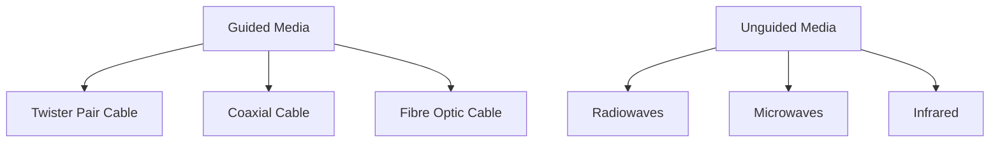

<FloatingButtonContainer>
   <SpoilerReveal></SpoilerReveal>
   <Scrambler></Scrambler>
</FloatingButtonContainer>

# CS 004 (Networks and Communications)

## Prelim

---

### !!Computer Network!!
- An interconnection of computers and computing equipment using either wires or radio waves over small or large geographic areas.

---

### !!LAN (Local Area Network)!!
- Networks that are small in geographic size spanning a room, floor, building, or campus.
- Group of computers connected with each other in small places.
- Secure because there is no outside connection.
- Considerably faster due to their small size.
- Can be wireless.

---

### !!MAN (Metropolitan Area Network)!!
- Networks that serve an area of 1 to 30 miles, approximately the size of a typical city.
- In MAN, various LAN are connected with each other.
- Size of MANs is larger than LANs but smaller than WANs.

---

### !!WAN (Wide Area Network)!!
- A large network that encompasses parts of states, multiple states, countries, and the world.
- Provides long distance transmission of data.
- Larger than LANs and MANs.

---

### !!PAN (Personal Area Network)!!
- A network of a few meters, between wireless devices such as PDAs, laptops, and similar devices.

---

### !!Voice Network!!
- A network that transmits only telephone signals.
- Almost extinct.

---

### !!Data Network!!
- A network that transmits voice and computer data.
- Replaces !!voice networks!!.

---

### !!Data Communications!!
- The transfer of digital or analog data using digital or analog signals.
- Exchange of data between 2 devices via some form of transmission media such as wire or cable.

---

### !!Telecommunications!!
- The study of telephones and the systems that transmit telephone signals.

---

### !!Network Management!!
- The design, installation, and support of a network, including its hardware and software.

---

### !!Network Cloud!!
- A network that contains software, applications, or data.
- Either local or remote.

---

### Communications Networks - Basic Layouts
- !!LAN-to-LAN!!
  - Found in systems that have 2 or more LANs and a need for them to intercommunicate.
- !!LAN-to-MAN!!
  - Used to interconnect companies.
  - High-speed networks with redundant circuits.
- !!LAN-to-WAN!!
  - One of the most common ways to interconnect a user on a LAN workstation to the Internet (a WAN).
- !!Sensor-to-LAN!!
  - Often found in industrial and laboratory environments.
- !!WAN-to-WAN!!
  - High-speed routers and switches are used to connect one wide area network to another.
- !!PAN-to-workstation!!
  - Interconnects wireless devices such as PDAs laptops and notebooks.
  - Used over short distances such as a few meters.
- !!Satellite and microwave!!
  - Typically long distance wireless connections.
- !!Cellphones!!
  - Constantly expanding market across the world.
- !!Microcomputer-to-LAN!!
  - Highly common throughout business and academic environments
  - Typically medium to high-speed connection
- !!Microcomputer-to-Internet!!
  - Popular with home users and small businesses
- !!Computer terminal / microcomputer-to-mainframe!!
  - Predominant form in the 60s and 70s

---

### !!Network Architectures!!
- A reference model that describes the layers of hardware and software necessary to transmit data between 2 points or for multiple devices / applications to interoperate.
- Has 2 models:
  - !!TCP/IP protocol suite!!
    - A connection oriented protocol and offers end-to-end packet delivery.
  - !!OSI model!!
    - Created by ISO *(!!International Organization for Standardization!!)*

---

### 5 Layers of TCP/IP Protocol Suite
- !!Application Layer!!
  - Where the application using the network resides.
  - Common network applications include web browsing, e-mail, file transfers, and remote logins.
- !!Transport Layer!!
  - Performs a series of miscellaneous functions *(at the end-points of the connection)* necessary for presenting the data package properly to the sender or receiver.
- !!Network *(Internet or Internetwork or IP)* Layer!!
  - Responsible for creating, maintaining and ending network connections.
  - Transfers data packet from node to node within network.
- !!Network Access *(Data Link)* Layer!!
  - Responsible for taking the data and transforming it into a frame with header, control and address information, and error detection code, then transmitting it between the workstation and the network.
- !!Physical Layer!!
  - Handles the transmission of bits over a communications channel.
  - Includes voltage levels, connectors, media choice, modulation techniques.

---

### 7 Layers of OSI *(!!Open Systems Interconnection!!)* Model
- !!Application Layer!!
  - Equivalent to TCP/IP's !!application!! layer.
- !!Presentation Layer!!
  - Responsible for *"final representation"* of data.
- !!Session Layer!!
  - Responsible for establishing *"sessions"* between users.
- !!Transport Layer!!
  - Equivalent to TCP/IP's !!transport!! layer.
- !!Network Layer!!
  - Equivalent to TCP/IP's !!network!! layer.
- !!Data Link Layer!!
  - Equivalent to TCP/IP's !!network access or data link!! layer.
- !!Physical Layer!!
  - Equivalent to TCP/IP's !!physical!! layer.

---

### !!Logical Connection!!
- A connection that exists only in the software.
- In network architecture, only the highest layers contains this connection.
- Flow of ideas that occurs between the sender and receiver at a particular layer without a direct connection.

---

### !!Physical Connection!!
- A connection that exists in the hardware.
- In network architecture, only the lowest layer contains this connection.

---

### !!Data!! *vs* !!Signals!!
- !!Data!! are entities that convey meaning.
- !!Signals!! are the electric or electromagnetic encoding of data.
- Both can either be analog or digital.
- These 2 are the basic building blocks of computer networks.
- All data transmitted over any communications medium is either !!digital!! or !!analog!!.

---

### 2 Types of Signal
- !!Analog Signal!!
  - A continuous waveform.
- !!Digital Signal!!
  - A discrete or non-continuous waveform.
  - Only limited number of defined values (1 and 0).
> It is harder to separate noise from an !!analog signal!! than it is to separate noise from a !!digital signal!!.

---

### 3 Components of Signals
- !!Amplitude!!
  - The height of the wave above or below a given reference point.
  - Measured in !!volts!!.
- !!Frequency!!
  - The number of times a signal makes a complete cycle within a given time frame.
  - Measured in !!hertz!! or !!cycles per second!!.
  - !!Spectrum!! is the range of frequencies that a signal spans from maximum to minimum.
  - !!Bandwidth!! is the absolute value of the difference between the lowest and highest frequencies of a signal.
- !!Phase!!
  - The position of the waveform relative to a given moment of time or relative to time zero.
  - A change can be any number of angles.

---

### 2 Important Factors Affecting the Transfer of a Signal
- !!Noise!!
- !!Attenuation!!

---

### !!Modulation!!
- A process where the analog waveform of the data is combined with another analog waveform to transmit analog data over an analog signal.

---

### 4 Main Combinations of Data and Signals
- !!Analog data transmitted using analog signals!!
  - Must modulate the data onto a set of analog signals
- !!Digital data transmitted using digital signals!!
  - Has 5 techniques: NRZ-L, NRZ-I, Manchester, Differential Manchester, Bipolar AMI
- !!Digital data transmitted using analog signals!!
  - Has 3 techniques: Amplitude shift keying, Frequency shift keying, and phase shift keying
- !!Analog data transmitted using digital signals!!
  - Has 2 techniques: Pulse code modulation and Delta modulation

---

### !!Data Codes!!
- Necessary to transmit the letters, numbers, symbols, and control characters found in text data.

---

### 3 Important Data Codes
- !!ASCII!!
  - Data code uses a 7-bit code and allows for !!128!! different letters, digits, and special symbols.
  - Most popular.
- !!EBCDIC!!
  - Uses an 8-bit code and allows for !!256!! different letters, digits, and special symbols. 
- !!Unicode!!
  - A 16-bit code that supports more than !!110!! different languages and symbol sets from around the world.

---

### !!Data Communication!!
- Process of using communication technologies to transfer data from one place to another, or between participating parties.
- Enables the movement of electronic or digital data between two or more network nodes.
- It incorporates several techniques and technologies to enable any form of electronic communication.
on any platform or in any digital environment.
- For !!data communications!! to occur, the communicating devices must be part of a communication system made of a combination of hardware and software.

---

### Components of Data Communication
- !!Message!!
  - The information to be communicated.
- !!Sender!!
  - It is the device which sends the data messages.
- !!Receiver!!
  - It is the device which receives the data messages.
- !!Medium!!
  - It is the physical path by which a message travels from sender to receiver.
- !!Protocol!!
  - Set of rules that governs the data communications.
  - It represents an agreement between the communicating devices.
  - Without this, 2 devices may be connected but not communicating.

---

### Different Data Flow Directions
- !!Simplex!!
  - Unidirectional, meaning one-way street.
  - Only 1 of the 2 devices can transmit.
- !!Half-Duplex!!
  - Both can transmit and receive but not at the same time.
- !!Duplex!!
  - Both can transmit and receive simultaneously.

---

### Types of Transmission Media
The diagram below shows the different types of transmission media:

---

### !!Guided Media!!
- Also referred to as *Wired* or *Bounded* transmission media.
- Signals being transmitted are directed using physical links.
- High-speed and secure.
- Used for comparatively shorter distances.

---

### !!Unguided Media!!
- Also referred to as *Wireless* or *Unbounded* transmission media.
- No physical medium is required.
- Signal is broadcasted through air.
- Less secure.
- Used for larger distances.

---

### 3 Major Types of Guided Media
- !!Twisted Pair Cable!!
  - Consists of 2 separately insulated conductor wires wound about each other.
  - Most widely used transmission media.
  - Has 2 types:
    - !!Unshielded Twisted Pair (UTP)!!
      - Has the ability to block interference.
    - !!Shielded Twisted Pair (STP)!!
      - Consists of special jacket to block external interference.
- !!Coaxial Cable!!
  - It has an outer plastic covering containing 2 parallel conductors each having a separate insulated protection cover.
  - Transmits information in 2 modes:
    - !!Baseband!!
      - Dedicated cable bandwidth.
    - !!Broadband!!
      - Cable bandwidth is split into separate ranges.
- !!Fibre Optic Cable!!
  - It uses the concept of reflection of light through a core made up of glass or plastic.
  - The core is surrounded by a less dense glass covering called the !!*cladding*!!. It is used for transmission of large volumes of data.
  - The WDM *(!!Wavelength Division Multiplexer!!)* supports 2 modes, namely !!unidirectional!! and !!bidirectional!! mode.

---

### 3 Major Types of Unguided Media
- !!Radiowaves!!
  - Easy to generate and can penetrate through buildings.
  - Antennas doesn't need to be aligned.
- !!Microwaves!!
  - A line of sight transmission.
  - Antennas need to be aligned.
  - Distance covered by the signal is proportional to the height of the antenna.
- !!Infrared!!
  - Used for very short distance communication.
  - Cannot penetrate through obstacles.

---

### Network Devices
- !!Repeater!!
  - Its job is to regenerate the signal over the same network before the signal becomes too weak.
  - Operates at the !!physical!! layer.
  - It does not amplify the signal.
- !!Hub!!
  - Basically a multiport repeater.
  - Connects multiple wires coming from different branches.
  - Cannot filter data so data packets are sent to all connected devices.
  - Do not have intelligence to find out the best path for data packets which leads to inefficiencies.
- !!Bridge!!
  - Operates at !!data link!! layer.
  - A repeater with add-on functionality which is the filtering of content by reading the MAC address.
  - Also used for interconnecting 2 LANs.
  - Has a single input and output port. Making it a 2-port device.
- !!Switch!!
  - A multiport bridge with a buffer and a design that can boost its efficiency.
  - A data link layer device.
  - Can perform error checking before forwarding data, which makes it efficient.
  - Divides collision domain of hosts, but broadcast remains the same. 
- !!Routers!!
  - It is a device like a switch that routes data packets based on their IP addresses.
  - Mainly a network layer device.
  - It normally connects LANs and WANs together.
  - Divides broadcast domains of hosts.

---

### Types of Network Topology
- !!Mesh!!
  - Each device is connected to every other device on the network through a dedicated point-to-point link.
  - <a href="https://images.spiceworks.com/wp-content/uploads/2022/03/10110856/20.png" target="_blank">See sample image</a>
- !!Star!!
  - Each device in the network is connected to a central device
called hub.
  - <a href="https://images.spiceworks.com/wp-content/uploads/2022/03/10110841/18.png" target="_blank">See sample image</a>
- !!Bus!!
  - In bus topology there is a main cable and all the devices are connected to  this main cable through drop lines.
  - <a href="https://images.spiceworks.com/wp-content/uploads/2022/03/10110911/16.png" target="_blank">See sample image</a>
- !!Ring!!
  - Each device is connected with the two devices on either side of it.
  - <a href="https://images.spiceworks.com/wp-content/uploads/2022/03/10110904/17.png" target="_blank">See sample image</a>
- !!Hybrid!!
  - Uses two or more differing network topologies.
  - <a href="https://images.spiceworks.com/wp-content/uploads/2022/03/10110834/21-3.png" target="_blank">See sample image</a>

---

### Types of Computer Network
- !!!
- !!!
- !!!
