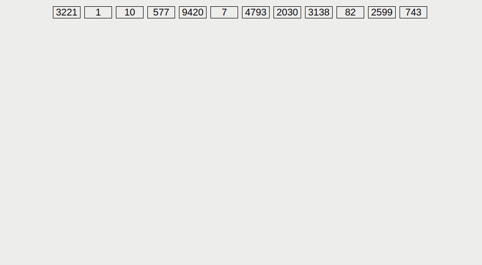

# CS 201A (Data Structures and Algorithms)

## Prelim

### Data Structure
- Branch of computer science.
- How data is organized
- How data flow is managed to increase the efficiency of any process or program.
- Structural representation of the logical relationship between data elements.
- Building blocks of any program or software.

> The most challenging task for a programmer is choosing the appropriate data structure for a program.

### Data
- Elementary value or the collection of values.
> For example, name or id are some data about a student.

### Group Items
- Data items that have subordinate data items
> For example, a name can have a first name and last name.

### Record
- Collection of various data items.
> For example, if we talk about a student entity, its name, address, course and marks can be grouped together to form the record for the student.

### File
- Collection of various records of 1 type of entity.
> For example, if there are 60 students in the class, then there will be 60 records in 1 file.

### Attribute and Entity
- An entity represents the class of certain objects.
- An entity contains various attributes.
- Each attribute represents the particular property of that entity.

### Field
- Single elementary unit of information representing the attribute of an entity.

### Why do we need Data Structure?
- It gives different levels of organization of data.
- It tells how data can be stored and accessed at its elementary level.
- It provides operation on a group of data, such as adding an item, and looking up the highest priority item.
- It provides a means to manage huge amounts of data efficiently.
- It provides fast searching and sorting of data.

### 2 Complementary Goals of Data Structure
1. Correctness
   - The primary goal of data structure, which always depends on the specific problems that the data structure is intended to solve
   - Data structure is designed such that it operates correctly for all kinds of input, which is based on the domain of interest.
2. Efficiency
   - An important factor that determines the success and failure of the process.
   - Data structure also needs to be efficient. It should process the data at high speed without utilizing much of the computer resources such as memory space.

### Array
- Collection of items stored in contiguous memory locations.
- Can contain primitives such as `int`, `char`, etc.
- Can also contain non-primitives such as `String` or custom classes.
- In the case of primitive data types, the actual values are stored.
> The idea of an Array is to store multiple items of the same type together.

::: details Code - Array Declaration
To declare an array, write the data type, followed by a set of square brackets[], followed by the identifier name.
```java
int[] ages;
// or
int ages[];
```
:::

::: details Code - Array Instantiation
To instantiate (or create) an array, write the new keyword, followed by the square brackets containing the number of elements you want the array to have.
```java
// declare
int[] ages;

// instantiate
ages = new int[100];

// declare + instantiate
int[] ages2 = new int[100];

// declare + instantiate + add data
int[] ages3 = { 12, 14, 16, 18 };
```
:::
> Instantiation in Java means the creation of a constructor. A constructor is a method that is called to create a certain object.

::: details Code - Accessing and Assigning Array Element
```java
int[] ages = { 12, 14, 16, 18 };

// access
ages[1]; // 14

// assign
ages[0] = 14; // ages = { 14, 14, 16, 18 };
```
:::

### Two-Dimensional Array
- Can be seen as a table with $x$ rows and $y$ columns where the row number ranges from $0$ to $x-1$ and column number ranges from $0$ to $y-1$.

::: details Code - Two-Dimensional Array
```java
String[][] table = new String[2][3];
table[0][0] = "😋";
table[0][1] = "🦢";
table[0][2] = "✌";
table[1][0] = "🎹";
table[1][1] = "🍤";
table[1][2] = "🚀";
```

Code of the `table` above can be seen as:
| column 0 | column 1 | column 2 |
| -------- | -------- | -------- |
| 😋        | 🦢        | ✌        |
| 🎹        | 🍤        | 🚀        |
:::

### ArrayList
- `ArrayList` is a part of collection framework and is present in `java.util` package.
- Provides a dynamic way of manipulating data.
- May be slower than standard arrays but can be helpful in programs where lots of manipulation is needed.
- Inherits `AbstractList` class and implements `List` interface.
- Initialized by size but the size can increase/decrease if its collection grows/shrinks. In other words, its size is dynamic.
- Allows us to randomly access the list.
> `ArrayList` in Java is similar to `vector` in C++.

### ArrayList Constructors
- `ArrayList()` - Build an empty array list.
- `ArrayList(Collection c)` - Build an array list initialized with the elements from `Collection c`.
- `ArrayList(int size)` - Build an array list with initial size.

::: details Code - Basic Structure of an ArrayList
```java
ArrayList<Integer> arrayList1 = new ArrayList<Integer>();
ArrayList<String> arrayList2 = new ArrayList<>();
ArrayList<Boolean> arrayList3 = new ArrayList();
```
:::

::: details Java ArrayList Methods
- `add(int index, Object element)` - This method is used to insert a specific element at a specific position index in a list.
- `add(Object o)` - This method is used to append a specific element to the end of a list.
- `addAll(Collection C)` - This method is used to append all the elements from a specific collection to the end of the mentioned list, in such an order that the values are returned by the specified collection’s iterator.
- `addAll(int index, Collection C)` - Used to insert all of the elements starting at the specified position from a specific collection into the mentioned list.
- `clear()` - This method is used to remove all the elements from any list.
- `clone()` - This method is used to return a shallow copy of an ArrayList.
- `contains(Object o)` - Returns true if this list contains the specified element.
- `ensureCapacity(int minCapacity)` - Increases the capacity of this ArrayList instance, if necessary, to ensure that it can hold at least the number of elements specified by the minimum capacity argument.
- `forEach(Consumer<? super E> action)` - Performs the given action for each element of the Iterable until all elements have been processed or the action throws an exception.
- `get(int index)` - Returns the element at the specified position in this list.
- `indexOf(Object O)` - The index the first occurrence of a specific element is either returned or -1 in case the element is not in the list.
- `isEmpty()` - Returns true if this list contains no elements.
- `lastIndexOf(Object O)` - The index of the last occurrence of a specific element is either returned or -1 in case the element is not in the list.
- `listIterator()` - Returns a list iterator over the elements in this list (in proper sequence).
- `listIterator(int index)` - Returns a list iterator over the elements in this list (in proper sequence), starting at the specified position in the list.
- `remove(int index)` - Removes the element at the specified position in this list.
- `remove(Object o)` - Removes the first occurrence of the specified element from this list, if it is present.
- `removeAll(Collection c)` - Removes from this list all of its elements that are contained in the specified collection.
- `removeIf(Predicate filter)` - Removes all of the elements of this collection that satisfy the given predicate.
- `removeRange(int fromIndex, int toIndex)` - Removes from this list all of the elements whose index is between fromIndex, inclusive, and toIndex, exclusive.
- `retainAll(Collection<?> c)` - Retains only the elements in this list that are contained in the specified collection.
- `set(int index, E element)` - Replaces the element at the specified position in this list with the specified element.
- `size()` - Returns the number of elements in this list.
- `spliterator()` - Creates a late-binding and fail-fast Spliterator over the elements in this list.
- `subList(int fromIndex, int toIndex)` - Returns a view of the portion of this list between the specified fromIndex, inclusive, and toIndex, exclusive.
- `toArray()` - This method is used to return an array containing all of the elements in the list in the correct order.
- `toArray(Object[] O)` - It is also used to return an array containing all of the elements in this list in the correct order same as the previous method.
- `trimToSize()` - This method is used to trim the capacity of the instance of the ArrayList to the list’s current size.
:::

### Stack
- Way to group things together by placing one thing on top of another and then removing things on at a time from the top of the stack.
- Last-In, First-Out (LIFO)
- Characterized by only 2 fundamental operations which is `push` and `pop`.
- Restricted data structure because only a small number of operations are performed on it.
- Linear data structure that follows a particular order in which the operations are performed.

> In stacks, elements are removed from the stack in the reverse order to the order of their addition: therefore, the lower elements are typically those that have been in the list the longest.

### Push Operation
- Adds an item to the top of the list.
- Hides any items that are already on the stack.
- Initializes the stack *if it is empty*.

### Pop Operation
- Removes an item from the top of the list and returns the removed item.
- Either reveals previously concealed items or results in an empty list.

> The nature of the `pop` and `push` operations means that stack elements have a natural order.

### Stack Class in Java
- Extends `Vector` which implements the `List` interface.
- A `Vector` is a resizable collection.

### Stack operations
1. `push(Object item)`
   - Used both to initialize the stack and to store values to it.
   - Responsible for inserting (copying) the value into the array and for incrementing the element counter (size).
   - Requires an item argument when called (the item to push).
2. `pop()`
   - Responsible for removing a value from the top of the stack, and decrementing the value of size.
   - Returns the item being removed in the stack.
3. `size()`
   - Used to determine the size of the stack.
   - Used mainly to control loops.
4. `peek()`
   - Method that looks at the item at the top of a stack.
   - Returns the items at the top without removing it.
5. `search(Object item)`
   - Returns the position of an item from the top of a stack.
   - Requires the desired item when called.
6. `empty()`
   - Tests if a stack object is empty or not.
   - Returns a boolean value.
   - Returns true if stack is empty, otherwise false.

### Infix to Postfix Algorithm (pseudocode)
```
initialize an empty stack
initialize an empty postfix expression string

for each token in infixExpression:
   if token is an operand:
      append token to postfix expression
   else if token is '(':
      push token onto the stack
   else if token is ')':
      while stack is not empty and top of stack is not '(':
         pop token from stack and append it to postfix expression
      pop '(' from stack (ignore it)
   else if token is an operator:
      while stack is not empty and precedence of token <= precedence of top of stack:
         pop operator from stack and append it to postfix expression
      push token onto the stack

while stack is not empty:
   pop token from stack and append it to postfix expression
```
### Infix to Prefix Algorithm (pseudocode)
```
initialize an empty stack
initialize an empty prefix expression string

reverse the infixExpression (so we can scan it from right to left)

for each token in infixExpression:
   if token is an operand:
      prepend token to prefix expression
   else if token is ')':
      push token onto the stack
   else if token is '(':
      while stack is not empty and top of stack is not ')':
         pop token from stack and prepend it to prefix expression
      pop ')' from stack (ignore it)
   else if token is an operator:
      while stack is not empty and precedence of token <= precedence of top of stack:
         pop operator from stack and prepend it to prefix expression
      push token onto the stack

while stack is not empty:
   pop token from stack and prepend it to prefix expression
```

## Midterm

### Queue
- An n-ordered list in which all insertions take place at one end, the **rear**, while all deletions take place at the other end, the **front**.
- It is an example of a linear data structure.  
- Has a First-In, First-Out (FIFO) structure where elements can only be added to the rear of the queue and removed from the front of the queue.
- It has two main operations, enqueue for insertion and dequeue for deletion.  

::: details Queue Operations
- `enqueue(new-item: item-type)` - Adds an item onto the end of the queue.
- `dequeue()` - Removes the item from the front of the queue.
- `front(): item-type` - Returns the item at the front of the queue.
- `back()`Returns the item at the front of the queue.
- `is-empty(): Boolean` - True if no more items can be dequeued and there is no front item.
- `is-full(): Boolean` - True if no more items can be enqueued.
- `push(newElement)` - Pushes a new element on to the end of the queue.
- `pop()` - Removes (but does not return) the element at the front of the queue
- `get-size(): Integer` - Returns the number of elements in the queue
:::

### Array Implementation of a Queue
- Insertion at the rear of the array is constant time.
- Removal from the front is linear time.
- Removal from the rear of the array is constant time.
- Insertion at the front is linear time.

> A circular array that is filled to capacity would require half the storage of a single-linked list to store the same number of elements.

### Linked List Implementation of a Queue
- Linked list implementations require more storage because of the extra space required for the links. Each node for a single-linked list would store a total of two references. Each node for a double-linked list would store a total of three references.

### Linked List
- A linear data structure, in which the elements are not stored at contiguous memory locations.
- The elements in a linked list are linked using pointers.
- A linked list consists of nodes where each node contains a data field and a reference(link) to the next node in the list.

### Types of Linked List
1. Singly Linked List
2. Doubly Linked List
3. Circular Linked List

### Singly Linked List
- Most common form of a Linked List where each node contains a data field and a single pointer to the next node in the list.
- The reference to the first node is called the **HEAD**.
- The pointer *(AKA the reference or link)* field contained in the node is used to traverse to the next node and to its next node and so on till we reach a node that points to NULL. This is the last node in the list.
- Can only be traversed in one and only one direction i.e. from head to the last node. No way to go backwards.

### Doubly Linked List
- A linked data structure that consists of a set of sequentially linked records called nodes.
- Each node contains two fields, called links, that are references to the previous and to the next node in the sequence of nodes.

### Circular Linked List
- A linked list where all nodes are connected to form a circle.
- There is no NULL at the end.
- A circular linked list can be a singly circular linked list or doubly circular linked list.

### Bubble Sort
- Simplest sorting algorithm that works by repeatedly swapping the adjacent elements if they are in the wrong order.

::: details Bubble Sort Animation

:::

### Selection Sort
- Simple and efficient sorting algorithm that works by repeatedly selecting the smallest (or largest) element from the unsorted portion of the list and moving it to the sorted portion of the list.

::: details Selection Sort Animation

:::

### Insertion Sort
- Builds the final sorted array one item at a time by comparisons.

::: details Insertion Sort Animation

:::

### Merge Sort
- A divide and conquer algorithm.
- Divides input array into two halves, calls itself for the two halves and then merges the two sorted halves.
- It uses a merge function to merge two halves. The `merge(arr, left, mid, right)` is a key process that assumes that `arr[left...mid]` and `arr[mid+1...right]` are sorted and merges the two sorted sub-arrays into one.
- The time complexity of Merge Sort is $O(n\log(n))$ in all 3 cases; worst, average and best as merge sort always divides the array into two halves and take linear time to merge two halves.
- Merge sort organize array elements by recursively dividing the set into two halves until the size becomes 1. Once the size becomes 1, the merge processes come into action and start merging arrays back till the complete array is merged.

::: details Merge Sort Animation

:::

### Quick Sort
- A divide and conquer algorithm.
- It picks an element as pivot and partitions the given array around the picked pivot.

### Different ways to pick a pivot in Quick Sort
1. Always pick the first element as a pivot.
2. Always pick the last element as the pivot (implemented below)
3. Pick a random element as pivot.
4. Pick median as a pivot.

> The key process in quick sort is a `partition()` function. The goal of partition is — given an array and an element $x$ of an array as the pivot, put $x$ at its correct position in a sorted array and put all smaller elements (smaller than $x$) before $x$, and put all greater elements (greater than $x$) after $x$. All this should be done in linear time.

### Quick Sort Time Complexity
- Best Case: $O(n\log(n))$ - The best case occurs when the partition process always picks the middle element as pivot. Following is recurrence for the best case.
- Average Case: $O(n\log(n))$ - We can get an idea of average-case by considering the case when partition, for instance, $O(n/9)$ elements in one set and $O(9n/10)$ elements in another set. 
- Worst Case: $O(n^2)$ - The worst case occurs when the partition process always picks the greatest or smallest element as pivot. If we consider the above partition strategy where the last element is always picked as a pivot, the worst case would occur when the array is already sorted in increasing or decreasing order.

::: details Quick Sort Animation

:::

### Bin/Bucket Sort
- Bin, also referred to as Bucket Sort runs in linear time on average.
- Like Counting Sort, bucket Sort is fast because it considers something about the input.
- Bucket Sort considers that the input is generated by a random process that distributes elements uniformly over the interval $[0,1)$.

::: info Bin/Bucket Sort Formula

<Markdown class="flex w-full justify-center p-4 text-4xl">
$\frac{ab}{c + 1}$
</Markdown>

Where:
- $a$ is the value of the current element
- $b$ is the array's length
- $c$ is the largest value in the array
:::

### Bin/Bucket Sort Algorithm
1. Partition $\mu$ into $n$ non-overlapping intervals called buckets.
2. Puts each input number into its buckets
3. Sort each bucket using a simple algorithm, e.g. Insertion Sort and then
4. Concatenate the sorted lists.

> Bucket Sort considers that the input is an $n$ element array $A$ and that each element $A_{i}$ in the array satisfies $0 ≤ A_{i} < 1$.
> The code depends upon an auxiliary array $B$ of linked lists (buckets) and considers that there is a mechanism for maintaining such lists.

::: details Bucket Sort Animation

:::

### Radix Sort
- One of the sorting algorithms used to sort a list of integer numbers in order.
- In radix sort algorithm, a list of integer numbers is sorted based on the digits of individual numbers.
- Sorting is performed from the least significant digit to the most significant digit.
- Not comparison based.

::: details Radix Sort Animation

:::
