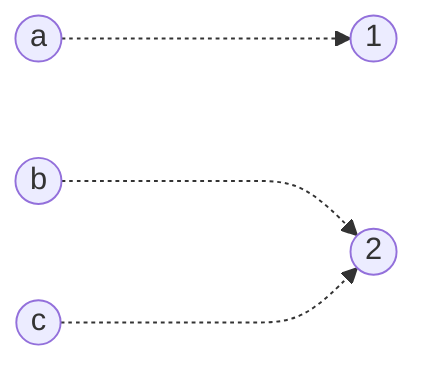

<FloatingButtonContainer>
   <SpoilerReveal></SpoilerReveal>
   <Scrambler></Scrambler>
</FloatingButtonContainer>

# CS 300 (Automata Theory and Formal Languages)

## Prelim

---

### !!Set!!
- A collection of objects.
- Comprises of objects called *"elements"* or *"members"*.
- It is called a !!*"singleton"*!! if it has only one element.

---

### 2 Common Ways to Indicate Members of a Set
- By !!listing!!
  - For example, !!$\set{a, e, i, o, u}$!!
- By !!providing some kind of an algorithm or a rule, such as grammar.!!
  - For example, !!$\set{ x \mid x \text{ is an english alphabet vowel} }$!!

---

### Notations to Denote Sets
- To indicate $x$ is a member of the set $S$:
  - !!$x \in S$!!
- If every element of set $A$ is also an element of set $B$, we say that $A$ is a *"subset"* of $B$.
  - !!$A \subseteq B$!!
- If every element of set $A$ is also an element of set $B$, but $B$ also has some elements not contained in $A$, we say that $A$ is a *"proper subset"* of $B$.
  - !!$A \subset B$!!
- Empty set
  - !!$\set{}$!!
  - !!$\emptyset$!!
- Union of set $A$ and set $B$
  - !!$A \cup B$!!
- Intersection of set $A$ and set $B$
  - !!$A \cap B$!!
- Difference of set $A$ and set $B$
  - !!$A - B$!!
- Complement of set $A$
  - !!$\overline{A}$!!
  - !!$A'$!!
- Cardinality of set $A$
  - !!$|A|$!!
- Power set of set $A$
  - !!$2^A$!!

---

### Set Operators
- !!Union!!
  - The !!*"union"*!! of 2 sets is the set that has objects that are elements of at least one of the two given sets, and possibly both.
  - The !!union!! of sets $A$ and $B$, is a set that contains everything in $A$ and $B$.
  - ::: details Example !!- Union!!
      $$
      \begin{align*}
      A &= \set{1, 2, 3} \\
      B &= \set{7, 8, 9} \\
      A \cup B &= \set{1, 2, 3, 7, 8, 9} \\
      \end{align*}
      $$
      :::

- !!Intersection!!
  - The !!*"intersection"*!! of sets $A$ and $B$, is a set that contains exactly those elements that are in both $A$ and $B$.
  - ::: details Example !!- Intersection!!
      $$
      \begin{align*}
      A &= \set{1, 2, 3} \\
      B &= \set{3, 4, 5} \\
      A \cap B &= \set{3} \\
      \end{align*}
      $$
      :::

- !!Set Difference!!
  - The !!*"set difference"*!! of sets $A$ and $B$, is the set that contains everything that is in $A$ but not in $B$.
  - ::: details Example !!- Set Difference!!
      $$
      \begin{align*}
      A &= \set{1, 2, 3} \\
      B &= \set{3, 4, 5} \\
      A - B &= \set{1, 2} \\
      B - A &= \set{4, 5} \\
      \end{align*}
      $$
      :::

- !!Complement!!
  - The !!*"complement"*!! of set $A$ is the set containing everything that is not in $A$.
  - ::: details Example !!- Complement!!
      $$
      \begin{align*}
      U &= \set{0, 1, 2, 3, 4, 5, 6, 7, 8, 9} \\
      A &= \set{x \mid x \text{ is an even positive integer} } \\
      \overline{A} = U - A &= \set{1, 3, 5, 7, 9} \\
      \end{align*}
      $$
      :::

---

### !!Disjoint Set!!
- If sets $A$ and $B$ have no common element ($A \cap B = \emptyset$), then $A$ and $B$ are said to be !!disjoint!!.

---

### !!Cardinality!!
- The number of elements in a set.
- Denoted as !!$|S|$!!.
- ::: details Example !!- Cardinality!!
   $$
   \begin{align*}
   A &= \set{1, 2, 3} \\
   |A| &= 3 \\
   \end{align*}
   $$
   :::

---

### !!Power Set!!
- The set of all possible subsets of some other set.
- Denoted as !!$2^S$!!.
- ::: details Example !!- Power Set!!
   $$
   \begin{align*}
   A &= \set{1, 2, 3} \\
   2^A &= \set{ \emptyset, \set{1}, \set{2}, \set{3}, \set{1, 2}, \set{2, 3}, \set{1, 3}, \set{1, 2, 3}} \\
   \end{align*}
   $$
   :::

---

### !!Cartesian Product!!
- The set of **all** ordered pairs $(a, b)$ where $a \in A$ and $b \in B$ is the !!*"Cartesian Product"*!! of the sets $A$ and $B$.
- Denoted as !!$A \times B$!!.
- ::: details Example !!- Cartesian Product!!
   $$
   \begin{align*}
   A &= \set{a, b, c} \\
   B &= \set{1, 2, 3} \\
   A \times B &= \set{(a, 1), (a, 2), (a, 3), (b, 1), (b, 2), (b, 3), (c, 1), (c, 2), (c, 3)} \\
   B \times A &= \set{(1, a), (1, b), (1, c), (2, a), (2, b), (2, c), (3, a), (3, b), (3, c)} \\
   \end{align*}
   $$
   :::

---

### !!Relations!!
- A !!*"relation"*!! on sets $A$ and $B$ is a set of ordered pairs $(a, b)$ where $a \in A$ and $b \in B$.
- A subset of the [Cartesian Product](#cartesian-product) of 2 sets.
- ::: details Example !!- Relations!!
   $$
   \begin{align*}
   A &= \set{a, b, c} \\
   B &= \set{1, 2, 3} \\
   R &= \set{(a, 1), (b, 2), (b, 3), (c, 3)} \\
   \end{align*}
   $$
   ```mermaid
   graph LR
      a((a))
      b((b))
      c((c))
      1((1))
      2((2))
      3((3))

      a -...-> 1
      b -...-> 2
      b -...-> 3
      c -...-> 3
   ```
   :::

---

### !!Equivalence Relation!!
- A subset $R$ of $A \times A$ is called an !!equivalence relation!! on $A$ if $R$ satisfies the following conditions:
  - !!Reflexive!!: $(a, a) \in R$ for all $a \in A$
  - !!Symmetric!!: $(a, b) \in R \rightarrow (b, a) \in R$ 
  - !!Transitive!!: $(a, b) \in R \wedge (b, c) \in R \rightarrow (a, c) \in R$ 

---

### !!Functions!!
- Supposed every element of $S$ occurs exactly once as the first element of an ordered pair. In the figure below, every element of $S$ has exactly one arrow arising from it. This kind of relation is called a !!*"function"*!!.
- It is said to map an element in its domain to an element in its range.
- Otherwise known as !!*"Mapping"*!!.
- No element in the domain maps to more than one element in the range.


---

### !!Graphs!!
- Contains a finite set of vertices, finite set of edges, and a function that assigns each edge a subset $\set{v, w}$ where $v$ and $w$ are vertices.
- ::: details Example !!- Graphs!!
   Given $V = \set{1, 2, 3, 4}$, $E = \set{e_1, e_2, e_3, e_4, e_5}$, and $f$ that is defined below:
   $$
   \begin{align*}
   f(e_1) = f(e_5) &= \set{1, 2} \\
   f(e_2) &= \set{4, 3} \\
   f(e_3) &= \set{1, 3} \\
   f(e_4) &= \set{2, 4} \\
   \end{align*}
   $$

   Then $G = (V, E, f)$ is a graph shown below:
   ```mermaid
   graph LR
      1((1))
      2((2))
      3((3))
      4((4))

      1 -...- 2 & 3
      2 -...- 1
      4 -...- 3
      2 -...- 4
   ```
   :::

---

### Graph Properties
- !!Degree of a Vertex!!
  - The number of edges having that vertex as an endpoint.
  - Count of the number of connections of edges with that vertex.
- !!Loop!!
  - A graph may have an edge frome a vertex to itself, such an edge is called a !!loop!!.
- !!Adjacent Vertices!!
  - Pair of vertices that determine an edge are !!*"adjacent"*!! vertices.
- !!Path!!
  - Consists of a pair $(V, E)$ of sequences in a graph.
- !!Circuit!!
  - A path that begins and ends at the same vertex.
  - Also called a !!path cycle!!.
- !!Simple Path!!
  - A path is called !!*"simple"*!! if no vertex appears more than once in the vertex sequence.
- !!Connected Graph!!
  - A graph is called !!*"connected"*!! if there is a path from any vertex to any other vertex in the graph, otherwise, the graph is !!*"disconnected"*!!.
- !!Components!!
  - If the graph is disconnected, the various connected pieces are called the !!*"components"*!! of the graph.
- !!Walk!!
  - A !!*"walk"*!! is a sequence of edges, where the finish vertex of each edge is the start vertex of the next edge.

---

### !!Trees!!
- A graph that is connected and has no simple cycle.

---

### !!Simple Cycle!!
- A path that does not repeat any nodes (except for the first and last).

---

### !!Directed Graph!!
- A graph that has arrows instead of lines.

---

### !!Outdegree!!
- The number of arrows pointing from a particular node in a graph.

---

### !!Indegree!!
- The number of arrows points to a particular node in a graph.

---

### !!Alphabet!!
- A finite set of symbols.
- Each symbols is either atomic or non-divisble.

---

### !!String!!
- A !!string!! over an alphabet is a finite sequence of symbols from that alphabet, which is usually written next to one another and not separated by commas.
- A string $s$ of length $k$ from alphabet $A$ is a sequence of $k$ symbols from $A$.

---

### !!Empty String!!
- A unique string containing no symbols.
- Represented by Greek letter $\lambda$ (lambda) or $\epsilon$ (epsilon).

---

### !!Kleene Closure!!
- Generates all possible strings from an alphabet.
- ::: details Example !!- Kleene Closure!!
   $$
   \begin{align*}
   A &= \set{0, 1} \\
   A^* &= \set{\lambda, 0, 1, 00, 01, 10, 11, 000, 001, 010, 011, 100, 101, 110, 111, \dots} \\
   \end{align*}
   $$
   :::

---

### !!Concatenation!!
- Let $A$ be an alphabet. Given 2 strings $s_1$ and $s_2$ from $A^*$. The concatenation of $s_1$ and $s_2$ is the string formed by joining the end of $s_1$ to the beginning of $s_2$.
- ::: details Example !!- Concatenation!!
   $$
   \begin{align*}
   A &= \set{a, b, c, \dots, x, y, z} \\
   s_1 &= \text{good} \\
   s_2 &= \text{man} \\
   c &= \text{goodman} \\
   \end{align*}
   $$
   :::

---

### Prefix and Suffix
- Given the concatenation of $\phi \psi \in A^*$, $\phi$ is the !!prefix!! while $\psi$ is the !!suffix!!.

---

### !!Language!!
- Given an alphabet $V$ and Kleene Closure $W = V^*$, then any subset of $W$ is a !!language!!.

---

### Operations on Languages
- !!Concatenation!!
  - ::: details Example !!- Concatenation!!
      $$
      \begin{align*}
      A &= \set{0, 1} \\
      B &= \set{a, b, c} \\
      AB &= \set{0a, 0b, 0c, 1a, 1b, 1c} \\
      \end{align*}
      $$
      :::
- !!Usual set operations!!

---

### String Reverse and Palindrome
- If $L$ is a language, then $L^R = \set{\omega^R \mid \omega \in L}$ where $R = \text{reverse}$.
- ::: details Example - Reverse
   $$
   \begin{align*}
   L &= \set{01, 00, 100, 110, 1111} \\
   L^R &= \set{10, 00, 001, 011, 1111} \\
   \end{align*}
   $$
   :::
- Palindrome is any word $\omega$ such that $\omega = \omega^R$. One example of a palidrome is the word "racecar".

---

### !!Chomsky Hierarchy!!
- It describes the hierarchy of the languages.
- This also states that the language on the outer circle encompasses the language at the inner circle.
- Each language class can be distinguished by its language structure and be recognized by a specific machine type.
- Classes of Formal Languages:
  - Type 0 (Outermost circle) - !!Recursively Enumerable!!
  - Type 1 - !!Context Sensitive!!
  - Type 2 - !!Context Free!!
  - Type 3 (Innermost circle) - !!Regular!!

---

### !!Grammar!!
- Describes the structure of the language.
- Mechanism to describe the languages.
- It is a 4-tupple $G = (V, T, S, P)$ where:
  - $V$ is the finite set of non-terminal symbols or variables.
  - $T$ is the finite set of terminal symbols.
  - $P$ is the finite set of production rules.
  - $S$ is the start symbol.
- Variables
  - Mostly represented by capital letters.
- !!Terminal Symbols!!
  - Set of symbols that can appear on any string accepted by the grammar.
- ::: details Example !!- Grammar!!
   The given grammar below describes the matching 0 and 1 language:
   $$
   \begin{align*}
   V &= \set{S} \\
   T &= \set{0, 1} \\
   P &= \set{ \\
      &S \rightarrow \text{01}; \\
      &S \rightarrow \text{0S1}; \\
      &S \rightarrow \lambda; \\
      } \\
   \end{align*}
   $$
   :::

---

### !!Derivation!!
- A process of applying continuous substitution of production rules to obtain the desired string.
- Has 2 possible ouputs:
  - !!Accepted!!
  - !!Rejected!!

---

### !!Parse Tree!!
- A graphical representation of a derivation process.

---

### !!Regular or Linear Grammar!!
- Grows only at one side of the string.
- ::: details Example !!- Regular Grammar!!
   The given grammar below describes a regular grammar because it can only grow at the end of the string:
   $$
   \begin{align*}
   V &= \set{S} \\
   T &= \set{0, 1} \\
   P &= \set{ \\
      &S \rightarrow \text{0S}; \\
      &S \rightarrow \text{1S}; \\
      &S \rightarrow \text{0}; \\
      } \\
   \end{align*}
   $$
   :::

---

### !!Regular Languages!!
- Generated by regular grammars.
- Represented by regular expression.
- Accepted by finite state accepters.
- !!Regular expression!! is the notation used to represent the members.

---

### !!Regular Expression!!
- The notation used to represent the members of a regular language.
- Special symbols:
  - `*` - !!0 or more occurences!!
  - `+` - !!1 or more occurences!!
  - `?` - !!0 or 1 occurences!!
  - `[]` - !!range of characters!!
  - `()` - !!grouping of characters!!
  - `|` - !!options or alternatives used in groupings!!
- ::: details Example !!- Regular Expression!!
   **Regular Expression: `(a+b)`**
   - Generates one or more `a` and a single `b` after those `a`s.
   - `aaaab`, `ab`, `aaab`
   
   **Regular Expression: `(b|a)*aaa(b|a)*`**
   - `aaa`, `baaa`, `baaab`
   :::

---

### !!Automata!!
- A self operating machine.
- Works by reading a sequence of input symbols and operates through some set of rules.

---

### Types of Automaton
- !!Deterministic Automata!!
  - Each move is unequally determined by the current configuration.
- !!Non-Deterministic Automata!!
  - A machine unable to identify the next state from current configuration due to no or multiple transition for some alphabet.

---

### !!Deterministic Finite Automata (DFA)!!
- A machine capable of recognizing members of a regular language.
- A 5-tupple $M = (Q, \Sigma, \delta, i, F)$ where:
  - $Q$ is !!the finite set of possible states!!
  - $\Sigma$ is !!the finite set of input alphabet!!
  - $\delta$ is !!the program of the machine (the transition functions)!!
  - $i$ is !!the initial state!!
  - $F$ is !!the set of final states!!
- ::: details Example !!- DFA!!
   Instruction list:

   $$
   \begin{align*}
   M &= (Q, \Sigma, \delta, i, F) \\
   Q &= \set{q_1, q_2, q_3, q_4} \\
   \Sigma &= \set{0, 1} \\
   F &= \set{q_2, q_4} \\
   \delta &= \set{ \\
      &\delta(q_1, 0)=q_2 \\
      &\delta(q_1, 1)=q_4 \\
      &\delta(q_2, 0)=q_3 \\
      &\delta(q_2, 1)=q_2 \\
      &\delta(q_3, 0)=q_3 \\
      &\delta(q_3, 1)=q_3 \\
      &\delta(q_4, 0)=q_4 \\
      &\delta(q_4, 1)=q_3 \\
      } \\
   \end{align*}
   $$
   
   The instructions above form the **state diagram** below:
   ```mermaid
   graph LR
      q1((q1))
      q2(((q2)))
      q3((q3))
      q4(((q4)))

      q1 -...-> |0|q2
      q2 -...-> |0|q3
      q1 -...-> |1|q4
      q4 -...-> |1|q3
      q2 -...-> |1|q2
      q4 -...-> |0|q4
      q3 -...-> |0,1|q3
   ```
   :::

> Each transition contains only at most 1 alphabet.

---
