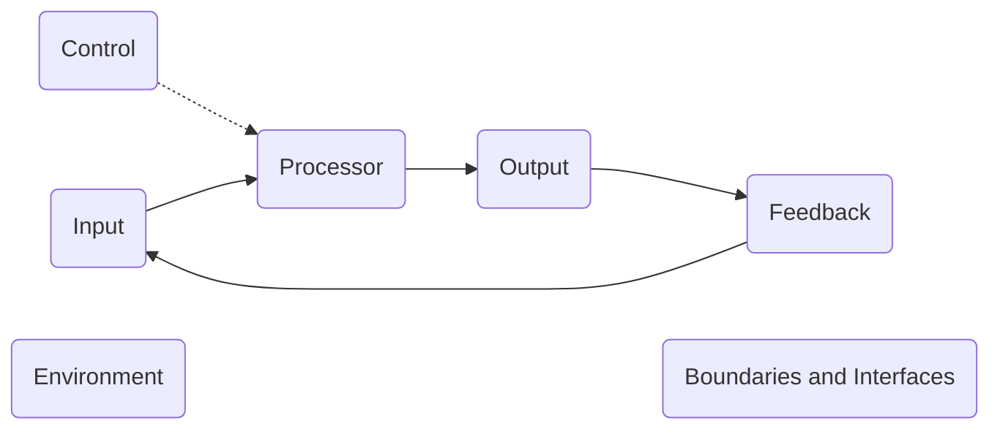
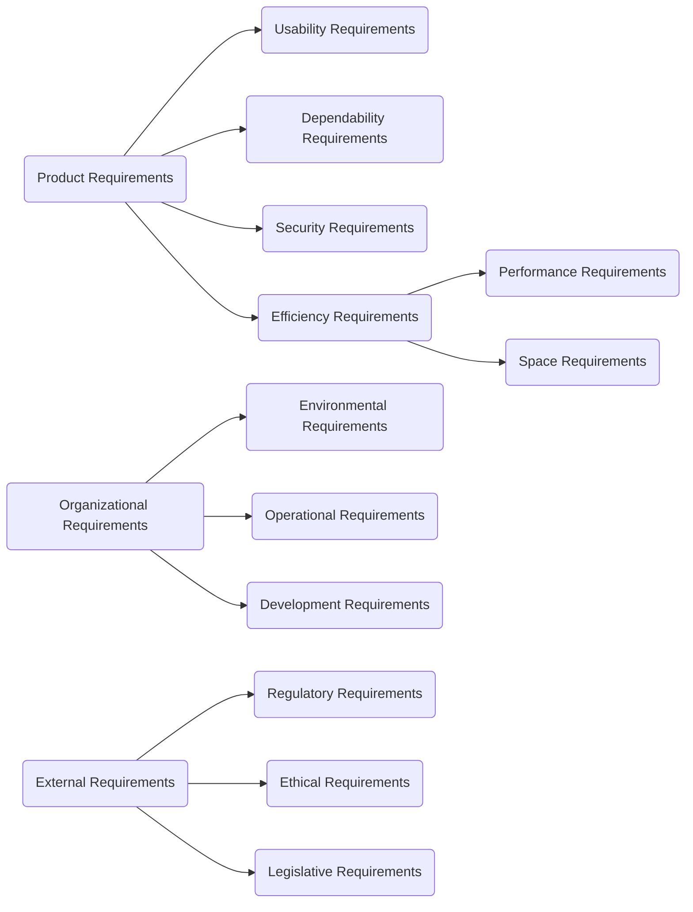

<FloatingButtonContainer>
   <SpoilerReveal></SpoilerReveal>
   <Scrambler></Scrambler>
</FloatingButtonContainer>

# CS 301 (Software Engineering I)

## Prelim

---

### !!Software!!
- A set of instructions or executable codes, libraries, and documentations.
- Can be developed for !!specific customer!! or !!general market!!.
- Byproduct of software engineering.

> A good software should deliver the required functionality and performance to the user and should be !!**maintainable**!!, !!**dependable and secured**!!, !!**efficient**!!, and !!**acceptable**!!.

---

### 2 Types of Software
- !!System Software (OS, Firmware, Drivers)!!
- !!Application Software (Browsers, MS Office products, MySQL or Oracle)!!

---

### 2 Types of Software That Can Be Developed
- !!Generic Products!!
  - Usually, these are standalone applications such as processors, databases, library system, etc.
- !!Customized Products!!
  - Software that are specific to customers because they have unique needs that the generic products.
  - This is where you come in as a software engineer.
  - Examples: System to support a business process such as traffic control.

---

### !!SaaS or Software As A Service!!
- Was released when cloud computing became popular.
- The concept is you pay for what you use.
- Also comes in a form of membership package such as *Free*, *Silver*, or *Gold* members.

---

### Attributes of a Good Software
- !!**Maintainability**!!
  - Can evolve to meet the changing needs of customers.
  - This is critical because software change is an inevitable requirement of a changing business environment.
- !!**Dependability and Security**!!
  - Characteristics such us reliability, security, and safety.
  - !!Dependable software!! should not cause physical or economic damage in the event of system failure.
  - Malicious users should not be able to access or damage the system.
- !!**Efficiency**!!
  - Software should not make wasteful use of system resources such as memory and processor cycles.
  - Includes responsiveness, processing time, memory utilization, etc.
- !!**Acceptability**!!
  - Software must be acceptable to the type of users for which it is designed.
  - It must be understandable, usable, and compatible with other systems that they use.

> That's why for us to build a good software, we must understand and apply the different concepts and techniques available in Software Engineering.

---

### !!Software Engineering!!
- An engineering discipline that is concerned with all aspects of software production from early stages of system specification through maintaining the system after it has gone into use.
- !!Planning!!, !!Analysis and Design!!, !!Implementation!!, !!Validation or Testing!!, !!Deployment!!, and !!Maintenance!! will always be encountered when you are already working out a software.
- Mainly focuses on:
  - !!Systems!!
  - !!Processes!!
  - !!Technology!!

---

### !!Software Engineering!! *vs* !!Computer Science!! *vs* !!System Engineering!!
- !!**Computer Science**!!
  - Focuses on theories and methods that underlie computer and software systems.
  - Theories such as data representation, automation, efficiency in coding and processes, as well as algorithms.
- !!**Software Engineering**!!
  - Concerned with practical problems of producing software.
  - Some knowledge of !!Computer Science!! is essential especially when dealing with non-functional requirements.
- !!**Systems Engineering**!!
  - Concerned with all aspects of computer-based systems development including hardware, software, and process engineering.
  - Software engineering is simply just a part of this.

---

### Issues Affecting Different Types of Software
- !!**Heterogeneity**!!
  - Ability of the software to operate on diversity of environment.
  - Example is deploying an app that supports multiple platforms.
- !!**Business and Social Change**!!
  - Business and society are changing fast and new technologies becomes available.
  - Example is government policies affecting business processes.
- !!**Security and Trust**!!
  - How to assure that malicious users cannot attack the software and information security is maintained.
  - Example is how different organizations cope up with new threats of hacking.

---

### Software Engineering Diversity
Software Engineering is very diverse that the following can be one of the software that you will be working out in the future:
- !!Standalone application!!
- !!Interactive transaction-based applications!!
- !!Embedded control systems!!
- !!Batch processing systems!!
- !!Entertainment systems!!
- !!Systems for modeling and simulation!!
- !!Data collection systems!!
- !!System of systems!!

---

### Software Engineering Ethics
- !!**Confidentiality**!!
  - Must respect the confidentiality of clients or employers regardless of availability of confidentiality agreement.
  - In the industry, this is called !!Non-Disclosure Agreement!!. This is an agreement between client-vendor for non-disclosing any details to non-stakeholders.
- !!**Competence**!!
  - One should not knowingly accept work that is outside of competence.
  - One should be honest that if it is not their forte or specialization, then they should not take work because it is too risky.
- !!**Intellectual Property Rights**!!
  - Observance of local laws and international on the use of Intellectual Property such as patents and copyright.
- !!**Computer Misuse**!!
  - One should not use technical skills to misuse other people's computer.

---

### Software Engineering Code of Ethics and Professional Practice
- !!**Public**!!
  - Software engineers shall act consistently with the public interest.
- !!**Client and Employer**!!
  - Software engineers shall act in a manner that is in the best interests of their client and employer consistent with the public interest.
- !!**Product**!!
  - Software engineers shall ensure that their products and related modifications meet the highest professional standards possible.
- !!**Judgement**!!
  - Software engineers shall maintain integrity and independence in their professional judgement.
- !!**Management**!!
  - Software engineering managers and leaders shall subscribe to and promote an ethical approach to the management of software development and maintenance.
- !!**Profession**!!
  - Software engineers shall advance the integrity and reputation of the profession consistent with the public interest.
- !!**Colleagues**!!
  - Software engineers shall be fair to and supportive of their colleagues
- !!**Self**!!
  - Software engineering shall participate in lifelong learning regarding the practice of their profession and shall promote and ethical approach to the practice of the profession.

---

### !!Systems Development!!
- Systematic process that includes phases such as planning, analysis, design, deployment, and maintenance.

---

### !!Systems Analysis!!
- Process of collecting and interpreting facts, identifying the problems, and decomposition of a system into its components.
- Conducted for the purpose of studying a system or its parts in order to identify its objectives.
- Problem-solving technique that improves the system and ensures that all the components of the system work efficiently to accomplish its purpose.
- Specifies **what the system should do**.

---

### !!Systems Design!!
- Process of planning a new business system or replacing an existing system by defining its components or modules to satisfy the specific requirements.
- Focuses on **how to accomplish the objective of the system**.

---

### !!System!!
- Derived from the Greek word !!*"Systema"*!!, which, means an organized relationship between any set of components to achieve some common cause or objective.
- An orderly grouping of interdependent components linked together according to a plan to achieve a specific goal.
- Set of components that interact to achieve a common goal.

---

### 3 Basic Constraints of a System
- A system must have some !!**structure and behavior**!! which is designed to achieve a predefined objective.
- !!**Interconnectivity**!! and !!**interdependence**!! must exist among the system components.
- The !!**objectives of the organization have a higher priority**!! than the objectives of its subsystems.

---

### Properties of a System
- !!**Organization**!!
  - Implies structure and order.
  - Arrangement of components that helps achieve predetermined objectives.
- !!**Interaction**!!
  - The manner in which the components operate with each other.
- !!**Interdependence**!!
  - How the components of a system depend on one another.
  - For proper functioning, the components are coordinated and linked together according to a specified plan.
  - The output of one subsystem is required by other subsystems as input.
- !!**Integration**!!
  - Concerned with how system components are connected together.
  - It means that the parts of the system work together within the system even if each part performs a unique function.
- !!**Central Objective**!!
  - The objective of the system must be central. It may be real or stated.
  - It is not uncommon for an organization to state an objective and operate to achieve another.

---

### Elements of a System
The diagram below shows the elements of a system:

- !!**Inputs and Outputs**!!
  - The main aim of a system is to produce an output that is useful for its user.
  - !!Inputs!! are the information that enters into the system for processing.
  - The !!output!! is the outcome of processing.
- !!**Processors**!!
  - Involves the actual transformation of input into an output.
  - The operational component of a system.
  - May modify the input depending on the output specification.
  - As the output specifications change, so does the processing. In some cases, the !!input!! is also modified to enable the processor for handling the transformation.
- !!**Control**!!
  - It guides the system.
  - Decision-making subsystem that controls the pattern of activities governing input, processing, and output.
  - For example, in order to keep the system in balance, what and how much input is needed is determined by !!output specifications!!.
- !!**Feedback**!!
  - Provides control in a dynamic system.
  - !!Positive feedback!! is routine in nature that encourages the performance of the system.
  - !!Negative feedback!! is informational in nature that provides the controller with information for action.
- !!**Environment**!!
  - The *"supersystem"* within which an organization operates.
  - The source of external elements that strike on the system.
  - It determines how a system must function.
- !!**Boundaries and Interface**!!
  - A system should be defined by its boundaries.
  - !!Boundaries!! are the limits that identify its components, processes, and interrelationship when it interfaces with another system.

---

### Types of Systems
- !!**Physical or Abstract Systems**!!
  - !!Physical systems!! are tangible entities. We can touch and feel them.
  - !!Physical systems!! may be dynamic in nature.
  - !!Abstract systems!! are non-physical entities or conceptual that may be formulas, representation, or model of a real system.
- !!**Open or Closed Systems**!!
  - !!An open system!! must interact with its environment. It receives inputs from and delivers outputs to the outside of the system.
  - !!A closed system!! does not interact with its environment. It is isolated from environmental influences.
  - !!A **completely closed** system!! is rare in reality.
- !!**Adaptive or Non-Adaptive Systems**!!
  - !!Adaptive systems!! responds to the change in the environment in a way to improve their performance and to survive.
  - !!Non-adaptive systems!! does not respond to the environment.
- !!**Permanent or Temporary Systems**!!
  - !!Permanent systems!! persists for a long time.
  - !!Temporary systems!! is made for a specified time and after that, they are demolished.
- !!**Natural and Manufactures**!!
  - !!Natural systems!! are created by nature. For example, the Solar System.
  - !!Manufactured systems!! are man-made systems.
- !!**Deterministic or Probabilistic Systems**!!
  - !!Deterministic systems!! operates in a predictable manner and the interaction between system components is known with certainty.
  - !!Probabilistic systems!! shows uncertain behavior. The exact output is unknown.
- !!**Social, Human-Machine, Machine Systems**!!
  - !!Social system!! is made up of people.
  - In !!Human-Machine systems!!, both humans and machines are involved to perform a particular task. One example is computer programming.
  - !!Machine system!! is where human interference is neglected. All tasks are performed by the machine. For example, an autonomous robot.
- !!**Man-Made Information Systems**!!
  - An interconnected set of information resources to manage for a particular organization under DMC !!*(Direct Management Control)*!!.
  - This system includes hardware, software, communication, data, and application for producing information according to the need of an organization.

### 3 Types of Man-Made Information Systems
- !!**Formal Information System**!!
  - Based on the flow of information in the form of memos, instructions, etc.
  - From top-level to lower levels of management.
- !!**Informal Information System**!!
  - This is an employee-based system that solved the day to day work-related problems.
- !!**Computer-Based System**!!
  - This system is directly dependent on the computer for managing business applications.

---

### System Models
- !!**Schematic Models**!!
  - A 2D chart that shows system elements and their linkages.
  - Different arrows are used to show information flow, material flow, and information feedback.
- !!**Flow System Models**!!
  - Shows the orderly flow of the material, energy, and information that hold the system together.
  - For example, PERT !!**(Program Evaluation and Review Technique)**!! is used to abstract a real-world system in model form.
- !!**Static System Models**!!
  - Represents one pair of relationships such as *activity-time* or *cost-quantity*.
  - For example, the Gantt chart gives a static picture of *activity-time* relationship.
- !!**Dynamic System models**!!
  - Approximates the type of organization or application that analysts deal with.
  - It shows an ongoing, constantly changing status of the system.
  - Business organizations are !!dynamic systems!!.
  - Consists of [elements of a system](#elements-of-a-system).

---

### 3 Categories of Information
- !!**Strategic Information**!!
  - Required by topmost management for long-range planning policies for the next few years.
  - Achieved with the aid of DSS !!*(Decision Support System)*!!.
  - Type of information is !!**unstructured**!!.
  - Volume of information is !!**low condensed**!!.
- !!**Managerial Information**!!
  - Required by middle management for short and intermediate-range planning which is in terms of months.
  - Achieved with the aid of MIS !!*(Management Information Systems)*!!.
  - Type of information is !!**moderately structured**!!.
  - Volume of information is !!**moderately processed**!!.
- !!**Operational Information**!!
  - Required by low management for daily and short term planning to enforce day-to-day operational activities.
  - Achieved with the aid of DPS !!*(Data Processing Systems)*!!.
  - Type of information is !!**highly structured**!!.
  - Volume of information is !!**large detail reports**!!.

---

### !!DIS!!
- Stands for !!Decision Support System!!.
- Computerized program used to support determinations, judgments, and courses of action in an organization.

---

### !!MIS!!
- Stands for !!Management Information System!!.
- Computer system consisting of hardware and software that serves as the backbone of an organization's operations.

---

### !!DPS!!
- Stands for !!Data Processing System!!.
- Manipulation of data by computers.

---

### !!ESS!!
- Stands for !!Executive Support System!!.
- Intended to be used by the senior managers directly to provide support to non-programmed decisions in strategic management.

---

### !!Information System!!
- Collection of components that work together to provide information to help in the operations and management of an organization.
- Hardware, software, data, people, and procedures that work together to produce quality information.

---

### !!Information Technology!!
- Integration of computers, communications equipment, and other technology used in information systems.

---

### Key Ideas for Project Initiation or System Request
- !!Feasibility analysis!! helps determine whether or not to proceed with the project.
- Projects are selected based on !!business needs!! and !!project risks!!.
- The !!project sponsor!! is a key person who identifies business value to be gained from using information technology.
- The !!approval committee!! reviews system requests from groups throughout the organization and selects projects for the benefit of the business.

---

### How Do Projects Begin?
- !!Business needs!! should drive projects.
- !!Project sponsor!! recognizes business need for new system and desires to see it implemented.
- !!Business needs!! determine the system's functionality (what it will do).

---

### !!System Request!!
- A document describing business reasons for project and system's expected value.
- It lists a project's key elements which are:
  - !!Project sponsor!!
  - !!Business need!!
  - !!Business value!!
  - !!Business requirements!!
  - !!Special issues or constraints!!

---

### Preliminary Project Acceptance
- !!System request!! is reviewed by approval committee.
- Based on information provided, !!project merits!! are assessed.
- Worthy projects are accepted and undergo additional investigation – the !!feasibility analysis!!.

---

### System Requirements Checklist (With Examples)
- !!**Inputs**!!
  - Manufacturing employees must **swipe their ID cards** into online data collection terminals that record labor costs and calculate production efficiency.
  - The department head must **enter overtime hours** on a separate screen.
- !!**Processes**!!
  - The student records system must **calculate the GPA** at the end of each semester.
  - As the final step in year-end processing, the payroll system must **update employee salaries, bonuses, and benefits and produce tax data** required by the IRS.
- !!**Performance**!!
  - The system must support 25 online users simultaneously.
  - Response time must not exceed four seconds.
- !!**Controls**!!
  - The system **must provide logon security** at the operating system level and at the application level.
  - An employee record must be added, changed, or deleted **only by a member of the human resources department**.
- !!**Scalability**!!
  - !!A scalable system!! offers a better return on the initial investment.
  - To evaluate !!scalability!!, you need information about projected future volume for all outputs, inputs, and processes.

---

### Requirements
- Requirements are best determined by !!systems analysts!! and !!business people!! together.
- Techniques available to the !!systems analyst!!:
  - !!Interviews!!
  - !!Questionnaires!!
  - !!Observation!!
  - !!JAD *(Joint Application Development)*!!
  - !!Document analysis!!
- A requirement is a statement of what the system must do or what characteristics *(features)* it needs to have.

---

### Requirements Elicitation Techniques
- !!**Interviews**!!
  - This is the most used.
- !!**JAD**!!
  - Stands for !!Joint Application Development!!.
  - A structured process in which 10-20 users meet under the direction of a facilitator skilled in JAD techniques.
  - A facilitator is a person who sets the meeting agenda and guides the discussion but does not join in as a participant.
- !!**Questionnaires**!!
  - Set of written questions for obtaining information from individuals.
  - We use it when there are many people involved from whom the information and opinions are needed.
- !!**Document Analysis**!!
  - One way of understanding the *"as-is"* existing system is to analyze the documents.
- !!**Observation**!!
  - The act of watching processes being performed.
  - Powerful tool in understanding the *"as-is"* system.
  - It gives the analyst the reality rather than listening to stories and descriptions during interviews or JAD sessions.

---

### 3 Types of Interview Questions (With Examples)
- !!**Closed-ended**!!
  - How many telephone orders are received per day?
  - How do customers place orders?
- !!**Open-ended**!!
  - What do you think about the way invoices are currently processed?
  - What are some of the problems you face daily?
- !!**Probing questions**!!
  - Why?
  - Can you give me an example? Can you explain that in more detail?

---

### Requirements Analysis Strategies
- !!**Problem Analysis**!!
  - Asking the users and managers to identify the problems with the *as-is* system and describe how to solve them with the *to-be* system.
- !!**Root Cause Analysis**!!
  - It focuses on the problems first rather than the solutions.
- !!**Duration Analysis**!!
  - Requires a detailed examination of the amount of time it takes to perform each process in the current *as-is* system.
  - In here, you recreate a scenario with different methods and set time on each process to see the fastest way.
- !!**Activity-Based Costing**!!
  - Unlike duration analysis where we measure time, here, we estimate the cost associated with each process.
  - Assigning value is simple; you just examine the direct cost of labor and materials for each input.
- !!**Informal Benchmarking**!!
  - It refers to studying how other organizations perform a business process to learn how your organization can do something better.
- !!**Outcome Analysis**!!
  - Focuses on understanding the primary outcomes that provide value to customers.
- !!**Technology Analysis**!!
  - Starts by having the analyst and managers develop a list of essential and exciting technologies. Then the group systematically identifies how each technology could be applied to the business process and determines how the business would benefit it.
- !!**Activity Elimination**!!
  - The analyst and managers work together to identify how the organization could eliminate each activity in the business process, how the function could operate without it, and what effects could likely occur.

---

### !!Functional Requirements!!
- Statements of services the system should provide.
- How the system should react to inputs.
- How the system should behave in situations.

---

### !!Non-Functional Requirements!!
- Constraints on the services, or the functions offered by the system.
- They include timing constraints, development process constraints, and constraints imposed by the standards.
- May affect the overall architecture of a system rather than individual components.
- A single non-functional requirement may generate several related functional requirements.

---

### Types of Non-Functional Requirements
The following summarizes the non-functional requirements:

- !!**Product Requirements**!!
  - Specifies the behavior of the software.
- !!**Organizational Requirements**!!
  - These are broad system requirements derived from policies and procedures in the customer's and the developer's organization.
- !!**External Requirements**!!
  - Covers all requirements that are derived from factors external to the system and its development process.

---

### Non-Functional Requirements Examples
- !!**Operational**!!
  - The system should be able to fit in a pocket or purse.
  - The system should be able to integrate with the existing inventory system.
- !!**Performance**!!
  - Any interaction between the user and the system should not exceed 2 seconds.
  - The system should receive updated inventory information every 15 minutes.
- !!**Security**!!
  - Only direct managers can see personnel records of staff.
  - Customers can see their order history only during business hours.
- !!**Cultural & Political**!!
  - The system should be able to distinguish between United States and European currency.
  - The system shall comply with insurance industry standards.

---

### !!System Proposal!!
- The result of the planning and analysis phases
- Typically includes:
  - !!Executive summary!!
  - !!System request!!
  - !!Work plan!!
  - !!Feasibility analysis!!
  - !!Requirements definition!!
  - !!Evolving system models!!

---

### !!Documentation!!
- The need for recording facts.
- Collection and summarization of data and information.
- Includes reports, diagrams, programs, and other deliverables.

---

### !!Feasibility!!
- Measure of how suitable system development will be to the company.
- Has 4 tests:
  - !!Operational feasibility!!
  - !!Schedule feasibility!!
  - !!Technical feasibility!!
  - !!Economic *(or cost or benefit)* feasibility!!

---

### Evaluating Feasibility
- The first step in evaluating feasibility is to !!identify and weed out systems requests that are not feasible!!.
- Even if the request is feasible, it might not be necessary.
- !!Feasibility analysis!! is an ongoing task that must be performed throughout the systems development process.

---

### Preliminary Investigation Overview
- Step 1: Understand the !!Problem!! or !!Opportunity!!
- Step 2: Define the !!Project Scope!! and !!Constraints!!
- Step 3: Perform !!Fact-Finding!!
- Step 4: Analyze !!Project Usability!!, !!Cost!!, !!Benefit!!, and !!Schedule Data!!
- Step 5: Evaluate !!Feasibility!!
- Step 6: Present !!Results!! and !!Recommendations!! to Management

---

### !!Organizational Feasibility!!
- If we build it, will they come?
- How well do the project goals align with business objectives?
- Strategic alignment, stakeholder analysis, project champion(s), organizational management, and system users.

---

### !!Technical Feasibility!!
- Can we build it?
- Have we used it before? How new is it?
- Users' and analysts' familiarity with the business application area.
- Familiarity with technology.
- Number of people, time, and features.
- Project size, compatibility with existing systems.
- Logical and tactical plan on how your business will produce, store, deliver, and track its products and services.

---

### !!Economic Feasibility!!
- Should we build it?
- Identify costs and benefits.
- Assign values to costs and benefits.
- Determine cash flow and assess financial viability.
- NPV !!*(Net present value)*!!, ROI !!*(Return on investment)*!!, BEP !!*(Break even point)*!!

---

### !!Tangible!! *vs* !!Intangible Costs!!
- !!Tangible Costs!!
  - Includes revenue that the system enables the organization to collect, such as increased sales.
- !!Intangible Costs!!
  - Are based on intuition and belief rather than *"hard numbers"*.

---

### Phases of System Development Cycle
- !!**Phase 1: Planning**!!
  - Review project requests
  - Prioritize project requests
  - Allocate resources
  - Identify project development team
- !!**Phase 2: Analysis**!!
  - Conduct preliminary investigation
  - Perform detailed analysis activities
    - Study current system
    - Determine user requirements
    - Recommend solution
- !!**Phase 3: Design**!!
  - Acquire hardware and software if necessary
  - Develop details of system
  - Prototyping
- !!**Phase 4: Implementation**!!
  - Develop programs if necessary
  - Install and test new system
  - Train users
  - Convert to new system
- !!**Phase 5: Support**!!
  - Conduct post-implementation system review
  - Identify errors and enhancements
  - Monitor system performance

---

### !!System Analyst!!
- Responsible for designing and developing information system.
- Bridge between users and IT professionals.
- A person who uses analysis and design techniques to solve business problems using information technology.

---

### Reasons to Create or Modify an Information System
- To !!correct the problem in existing system!!
- To !!improve existing system!!
- !!Outside group may mandate change!!
- !!Competition can lead to change!!

---

### !!RACI Matrix!!
- It's a great way to define and assign these responsibilities.
- It charts who is !!**Responsible**!!, !!**Accountable**!!, !!**Consulted**!!, !!**Informed**!! for each task.
- Mapping this out helps to reduce confusion, distribute workload, and increase efficiency.

---

### !!Schedules!!
- The listing of activities, deliverables, and milestones within a project.
- Usually includes the planned start and finish date, duration, and resources assigned to each activity.

---

### !!Gantt Chart!!
- Type of bar chart the illustrates a project schedule.

---

### !!Cost Estimate!!
- The approximation of the cost of a program, project, or operation.
- The product of the cost estimating process.
- Has a single total value and may have identifiable component values.

---

### !!Analysis Phase!!
- This is where the project lifecycle begins.
- This is where you break down the deliverables in the high-level project charter into more detailed business requirements.
- This is where you identify the overall direction that the project will take through the creation of the project strategy documents.

---

### !!Project Charter!!
- It is a formal document based on the SoW *(!!Statement of Work!!)* which is submitted for authorization.
- It gives the project manager the authority to spend the project budget in  the delivery of the project.
- Its objectives are to address the *"why, who, what, when, where, and how"* of the project.

---

### !!ERD!!
- Stands for !!Entity Relationship Diagram!!.
- A snapshot of data structures.
- Shows the entities *(or tables)* in a database and the relationships between them.
- It's essential to have this for a good database design.

---

### !!Use Case Diagram!!
- It can summarize the details of your system's users and their interactions with the system.

---

### !!Design Phase!!
- Acquire hardware and software.
- Develop all details of new or modified information system.

---

### !!3 Basic Documents Used to Summarize Technical Specifications!!
- !!**RFQ**!!
  - Stands for !!Request For Quotation!!.
  - Identifies the products you want.
  - Vendor quotes prices for listed products.
- !!**RFP**!!
  - Stands for !!Request For Proposal!!.
  - Vendor selects products that meets your requirements and then quotes prices.
- !!**RFT**!!
  - Stands for !!Request For Information!!.
  - Less formal method that uses standard form to request information about product or service.

---

### !!Mockup!!
- Sample of input or output that contains actual data.

---

### !!Prototype!!
- Working model of proposed system.
- Beginning a !!prototype!! too early may lead to problems.

---

### !!CASE!!
- Stands for !!Computer-Aided Software Engineering!!.
- Software tools designed to support activities of system development system.

---

### !!Implementation Phase!!
- Its purpose is to construct *(or build)* new or modified system and deliver it to users.
- Develop programs, install and test new system, train users, convert to new system.

---

### 3 Types of Tests Performed by System Developers
- !!**Unit Test**!!
  - Verifies each individual program works by itself.
- !!**Systems Test**!!
  - Verifies all programs in application work together.
- !!**Integration Test**!!
  - Verifies application works with other applications.

---

### !!Training!!
- Showing users exactly how they will use new hardware and software in the system.

---

### !!Support Phase!!
- Provides ongoing assistance after system is implemented.
- Monitor system performance, identify enhancements, identify errors, conduct post-implementation system review.

---

### 4 Fundamental Processes in Software Process Models
- !!**Software Specification**!!
  - Checks on the feasibility study focusing on the objective, cost, and the benefit of the organization.
  - Starts with feasibility study to initially check if the project can materialize in terms of implementation, cost, objectives of the organization.
  - Following feasibility study is the requirements elicitation and analysis, and requirements specification.
- !!**Software Design and Implementation**!!
  - Focuses on executing the system specification into an executable system.
  - Before development, you will also be doing the following:
    - Architectural design
    - Interface design
    - Component design
    - Database design
  - At this stage, client is not interested in this technicality, but as software engineers and software developers, this is crucial because these designs are a lot closer to how you perform your development.
- !!**Software Validation**!!
  - Focuses on implementing test strategies that were previously planned.
  - It is simply the testing of the output of the previous stage.
  - It's not purely testing. You must learn how to plan how you conduct your testing.
  - Here, you will also apply different types of testing such as component-based or system testing.
  - The final process here will be acceptance testing by using actual user data to validate if it is the same output/experience-based on the test data.
- !!**Software Evolution**!!
  - Focuses on the maintenance after system implementation.
  - This refers to the maintenance of the system. As explained before, one of the attributes of good software is maintainability.
  - In incremental models and agile development, this is very much in use because you are already planning which among the remaining features will be on the next iteration.

---

### !!System Design!!
- It is partitioning the requirements to hardware and software establishing an overall system architecture.

---

### !!Software Design!!
- It represents the software system functions in a form that can be transformed into one or more executable programs.

> To clarify, requirements define the function of the system from the client's viewpoint while system and software design describes the system from the software developer's viewpoint.

> When doing the system and software design, the client's representatives with no background in designing technicality need not be present during the discussion because they will not appreciate it.

---

### !!Systems Integration!!
- The process of bringing together the component sub-systems into one system and ensuring that sub-systems function together as a system.

---

### Software Process Models
- !!**Waterfall**!!
  - Has 5 phases or processes:
    - !!Phase 1: Requirements specification!!
      - The services, constraints, and goals are established in detail and serve as a system specification.
    - !!Phase 2: Software design!!
      - Identifying the requirements for either hardware or software and have an overall system architecture, system abstraction, and relationship.
      - This is where your architectural details, UML knowledge, Entity Relationship Diagram, and data flow diagrams will be used.
    - !!Phase 3: Implementation and unit testing!!
      - This stage is where programmers of software developers turn the design into the program.
      - If you are implementing Object-Oriented, part of this stage is to perform unit testing of each object.
    - !!Phase 4: Integration and system testing!!
      - Since from the previous stage, the process was to perform **unit test**, in this stage you are integrating different processes of the system to see if all requirements are met.
    - !!Phase 5: Operation and maintenance!!
      - The system is installed and put into use while at the same time fixing issues that were overlooked during the testing.
  - If you notice, they are synonyms of the 4 fundamental processes. What makes it famous though is how it performs those processes.
  - In this model, each phase should not start until the previous phase has finished. To indicate the phase is finished, it needs to have a "signed-off" document.
  - It needs to close the previous process before it can proceed to the next process.
- !!**Incremental Development**!!
  - Implements versioning by delivering functionalities in iterations.
  - It is based on the idea of developing an initial implementation *(with most functionality)*, exposing it to users for comments, and evolving it through several versions.
  - Has 3 benefits:
    - !!Customer change!!
      - The cost of accommodating customer requirements is reduced which means that the software can adapt to changes unlike in waterfall where there is no way of going back to the previous process.
      - In this model, the feedback can be carried over to the next release.
    - !!Easier customer feedback!!
      - Customers find it easier to comment on demonstration than that from software design documents.
    - !!Usefulness of product!!
      - Customers can use and gain value from the software earlier than waterfall process.
- !!**Reuse-oriented Software Engineering**!!
  - Uses existing components and integrates them into the system.
  - This approach is based on the existence of a significant number of reusable components. The process focuses on integrating these components into a system rather than developing from scratch.
  - This means that some part of what we are trying to build is already available either paid or free.
  - Has 4 stages:
    - !!Stage 1: Component analysis!!
      - In this stage, you will find out that when searching for components, usually there is no exact match, therefore only some functionalities are available.
    - !!Stage 2: Requirement modification!!
      - Requirements are modified based on requirements specifications. If modification is not available or not possible, a step may go back to component analysis.
    - !!Stage 3: System design with reuse!!
      - The framework of the system is designed considering the components that are reused. This means revisiting the design and incorporate the changes to reused components.
    - !!Stage 4: Development and integration!!
      - Systems that cannot be externally procured is developed. Components are integrated to create a new system or putting all the pieces. 
- !!**Prototyping**!!
  - It is an initial version of a software system that is used to demonstrate concepts.
  - This is usually used to check the feasibility of a proposed design.
- !!**Spiral Model**!!
  - It has the disadvantage of being expensive due to its long period of designing, developing, and implementation.
  - This model is not applicable to small projects due to its complexity in framework.
  - By Boehm (1988)
  - Its strength and the main difference between other models is its recognition of risks. This allows every loop to incorporate the following risks.
  - Has 4 sectors:
    - !!Sector 1: Objective setting!!
      - As early at this stage, you identify the possible risks and possible alternative same with constraints on the process of the products.
    - !!Sector 2: Risk assessment and reduction!!
      - For each risk identified from sector 1, make a detailed analysis and list down the steps to reduce the risks. You can incorporate a prototype to show that risk is reduced or avoided.
    - !!Sector 3: Development and validation!!
      - Perform development and validation by implementing different types of testing and plan and release the iteration.
    - !!Sector 4: Planning!!
      - Review of the project and check remaining items as well as check on the recently released iteration for improvement.
  - Advantages:
    - !!Risk handling!!
    - !!Good for large projects!!
    - !!Flexibility in requirements!!
    - !!Customer satisfaction!!
  - Disadvantages:
    - !!Complex!!
    - !!Expensive!!
    - !!Too much dependable on risk analysis!!
    - !!Difficulty in time management!!
- !!**Rational Unified Process**!!
  - Like other software process models, it is risk-driven, use-cased, architecture-centric, and iterative.
  - It also combines prototyping and incremental delivery.
  - Phase model that identifies 4 discrete phases:
    - !!Phase 1: Inception!!
      - Outputs: Objective statement, initial use case, risk assessment, project plan, prototypes, and models.
    - !!Phase 2: Elaboration!!
      - Outputs: Complete use case, architecture, project development plan, prototypes for tackling risks, user manual.
    - !!Phase 3: Construction!!
      - Outputs: Fully completed software system (this includes initial testing), user manual.
    - !!Phase 4: Transition!!
      - Outputs: Beta testing, training of users, and rollout or project deployment.

---

### 3 Types of Software Components
- !!**Web Services**!!
  - A component that can be reused because of its flexibility in the web environment.
  - This made significant advancement in the reuse-oriented model because it is very flexible and easy to implement.
- !!**Stand-alone Software**!!
  - A component that can be configured to work in a specific environment.
  - Normally this component is part of the hardware for integration purposes.
  - Examples are SDKs to allow the other hardware to communicate with your software.
- !!**Object Collection**!!
  - Developed as a package to be integrated into frameworks such as .NET or J2EE. Example is the package to manage the database connection.

---

### System Components
- !!Computer hardware!!
- !!Operating system!!
- !!File system!!
- !!I/O system!!
- !!Network!!

---

### !!Agile Software Development!!
- Focuses on managing iterative approach rather than technical approaches.
- Its methods rely heavily on incremental approach to software specification, development, and delivery.

---

### Principles of Agile Methods
- !!**Customer involvement**!!
  - Customer should be closely involved throughout the development process.
- !!**Increment delivery**!!
  - Software is developed in increments with the customer specifying the requirements to be included.
- !!**People not process**!!
  - Team members should be left to develop their own ways of working without prescriptive processes.
- !!**Embrace change**!!
  - Expect the system requirements to change and so design the system to accommodate these changes.
- !!**Maintain simplicity**!!
  - Focus on simplicity in both the software being developed and in the development process. 
  - Wherever possible, eliminate complexity from the system.

---

### Types of Agile Method
- !!Extreme Programming!!
- !!Scrum!!
- !!Crystal!!
- !!Lean!!
- !!Kanban!!
- !!Future Driven Development!!
- !!Dynamic System Development Method!!

---
