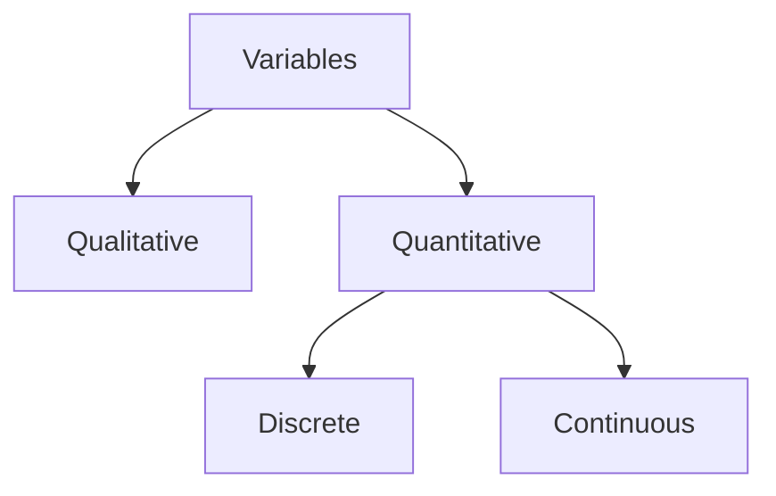

<FloatingButtonContainer>
   <SpoilerReveal></SpoilerReveal>
   <Scrambler></Scrambler>
</FloatingButtonContainer>

# MATH 009CS (Probability and Statistics)

## Prelim

---

### Formulas

::: details Formulas

#### Mean, Median, Mode (Ungrouped Data)
$$
\begin{align*}
\text{Mean} &= \frac{\sum{x_i}}{n} \\
\text{Median} &= \frac{x_{\frac{n}{2}} + x_{\frac{n}{2} + 1}}{2} \\
\text{Mode} &= \text{data with highest frequency} \\
\end{align*}
$$

#### Mean, Median, Mode (Grouped Data)
$$
\begin{align*}
\text{Mean} &= \frac{\sum{(frequency_i \times midpoint_i)}}{n} \\
\text{Median} &= \text{class with cumulative frequency on } \frac{n}{2} \\
\text{Mode} &= \text{class with highest frequency} \\
\end{align*}
$$

#### Frequency Distribution Table
$$
\begin{align*}

\begin{align*}
R &= H - L \\
k &= \lceil log_2(n) \rceil \\
i &= \Bigl\lceil \frac{R}{k} \Bigr\rceil \\
\end{align*}
&\text{ where }
\begin{align*}
R &= \text{Range} \\
H &= \text{Highest value in raw data} \\
L &= \text{Lowest value in raw data} \\
k &= \text{Number of classes} \\
n &= \text{Data size (summation of frequencies)} \\
i &= \text{Class boundary size} \\
\end{align*} \\

\end{align*}
$$

#### Measures of Dispersion
<!-- Standard deviation -->
$$
\begin{align*}

\begin{align*}
S = \sqrt{\frac{\sum{(x-\overline{x})^2}}{n-1}} \\
\end{align*}
&\text{ where }
\begin{align*}
S &= \text{Sample Standard Deviation} \\
\overline{x} &= \text{Mean of sample} \\
n &= \text{Sample size} \\
\end{align*} \\

\end{align*}
$$

<!-- Standard variance -->
$$
\begin{align*}

\begin{align*}
V = S^2 \\
\end{align*}
&\text{ where }
\begin{align*}
V &= \text{Sample Variance} \\
S &= \text{Sample Standard Deviation} \\
\end{align*} \\

\end{align*}
$$

<!-- Standard deviation (population) -->
$$
\begin{align*}

\begin{align*}
\sigma = \sqrt{\frac{\sum{(x-\mu)^2}}{N}} \\
\end{align*}
&\text{ where }
\begin{align*}
\sigma &= \text{Population Standard Deviation} \\
\mu &= \text{Mean of population} \\
N &= \text{Population size} \\
\end{align*} \\

\end{align*}
$$

#### Measures of Location
<!-- Quartile -->
$$
\begin{align*}

\begin{align*}
Q_k = \frac{k(n + 1)}{4}
\end{align*}
&\text{ where }
\begin{align*}
Q &= \text{Quartile} \\
k &= k_{th} \text{ quartile} \\
n &= \text{Size of data} \\
\end{align*} \\

\end{align*}
$$

<!-- Decile -->
$$
\begin{align*}

\begin{align*}
D_k = \frac{k(n + 1)}{10}
\end{align*}
&\text{ where }
\begin{align*}
D &= \text{Decile} \\
k &= k_{th} \text{ decile} \\
n &= \text{Size of data} \\
\end{align*} \\

\end{align*}
$$

<!-- Percentile -->
$$
\begin{align*}

\begin{align*}
P_k = \frac{k(n + 1)}{100}
\end{align*}
&\text{ where }
\begin{align*}
P &= \text{Percentile} \\
k &= k_{th} \text{ percentile} \\
n &= \text{Size of data} \\
\end{align*} \\

\end{align*}
$$

:::

---

### !!Statistics!!
- In plural sense, it is as set of numerical data.
- In singular sense, it is the branch of science which deals with the collection, presentation, analysis, and interpretation of data.

---

### !!Statistical Methods of Applied Statistics!!
- Refer to procedures and techniques used in the collection, presentation, analysis, and interpretation of data.

---

### !!Descriptive Statistics!!
- Methods concerned with the collection, description, analysis of a set of data with drawing conclusions or inferences about a large set.
- Its main concern is simply to describe the set of data such that otherwise obscure information is brought out clearly.
- The conclusions apply not only to the data on hand.

---

### !!Inferential Statistics!!
- Methods concerned with making predictions or inferences about a larger set of data using only the information gathered from a subset of this larger set.
- Its main concern is not merely to describe but actually predict and make inferences based on the information gathered.
- The conclusions are applicable to a larger set of data in which the data on hand is only a subset.

---

### !!Population!!
- A collection of all the elements under consideration in a statistical study.

---

### !!Sample!!
- A part or subset of the population from which the information is collected.

---

### !!Parameter!!
- A numerical characteristic of the population.

---

### !!Variable!!
- A characteristic or attribute of people or objects which can assume different values or labels for different people or objects under consideration.

---

### !!Measurement!!
- It is the process of determining the value or label of a particular variable for a particular experimental unit.

---

### !!Experiment Unit!!
- An individual or an object on which a variable is measured.

---

### Classification of Variables

#### !!Discrete!! *vs* !!Continuous!!
- !!Discrete!!
  - A variable which can assume finitely, or, at most countably infinite number of values, usually measured by counting or enumeration.
  - Examples are number of book pages, number of shoes, number of people, etc.
- !!Continuous!!
  - A variable which can assume infinitely many values corresponding to a line number.
  - Changes over time.
  - Examples are height or weight of students, number of stars in the universe, etc.

#### !!Qualitative!! *vs* !!Quantitative!!
- !!Qualitative!!
  - A variable that yields categorical responses.
  - Examples are political affiliation, occupation, marital status, etc.
- !!Quantitative!!
  - A variable that takes on numerical values representing an amount or quantity
  - Examples are weight, height, number of cars, etc.

---

### Levels of Measurement
- !!**Nominal**!!
  - It is the weakest level of measurement where numbers or symbols are used  simply for categorizing subjects into different groups.
  - Examples are genders, ethnicity, etc.
- !!**Ordinal**!!
  - The ordinal level of measurement contains the properties of the nominal level.
  - The numbers assigned to categories of any variable may be ranked or ordered in some low-to-high manner.
  - Examples are year level, rating, etc.
- !!**Interval**!!
  - It has the properties of the nominal and ordinal levels.
  - The distances between any 2 numbers on the scale are of known sizes.
  - An !!interval scale!! must have a common and constant unit of measurement.
  - The unit of measurement is arbitrary and there is no *"true zero"* point.
  - Examples are temperature in celcius or farenheit, IQ, SAT scores, etc.
- !!**Ratio**!!
  - It has the properties of interval level.
  - It has a *"true zero"* point.
  - Examples are age (in years), temperature in kelvin, number of correct answers in an exam, etc.

---

### !!Frequency Distribution!!
- Here, data are summarized into classes or categories to show the frequency of occurrence of values or objects in each class or category.

---

### !!Quantitative Frequency Distribution!!
- Here, data are grouped according to numerical intervals or classes.

---

### !!Qualitative Frequency Distribution!!
- Here, data are tabulated in terms of categories.

---

### !!Classes!!
- Numerical intervals. e.g. 11-20, 21-30

---

### !!Class Limits!!
- Refers to the lowest and highest value the can enter in each class. e.g. in the interval 11-20, 11 is the lower class and 20 is the upper class.

---

### !!Frequency!!
- Number of values that fall in a given class.
- Usually represented by $f$.

---

### !!Class Midpoint or Class Mark!!
- A single value representing a given class.
- Can be obtained by $x=\frac{\text{Lower} + \text{Upper}}{2}$

---

### !!Class Boundary!!
- Commonly known as the true limit.
- Refers to the value midway between the upper limit of a certain class and the lower limit of the next.

---

### Construction of the Frequency Distribution Table (Grouped Data)
<table border="1">
  <thead>
    <tr>
      <th>Classes</th>
      <th>Tally</th>
      <th>Frequency (<Markdown>$f$</Markdown>)</th>
      <th>Midpoint (<Markdown>$x$</Markdown>)</th>
      <th><Markdown>$\%f$</Markdown></th>
      <th><Markdown>$&lt;Cf$</Markdown></th>
      <th><Markdown>$&gt;Cf$</Markdown></th>
      <th>Class Boundaries</th>
    </tr>
  </thead>
  <tbody>
    <tr>
      <td>...</td>
      <td>...</td>
      <td>...</td>
      <td>...</td>
      <td>...</td>
      <td>...</td>
      <td>...</td>
      <td>...</td>
    </tr>
  </tbody>
</table>

---

### !!Relative Frequency Distribution!!
- Shows the proportion in percent the frequency of each class to the total frequency.
- Can be obtained by $\%f=\frac{f}{n} \times 100$

---

### !!Cumulative Frequency!!
- Tries to determine the partial sums of data classified in terms of classes. This distribution can
be obtained by adding the class frequencies.
- Types:
  - !!Less Than Cumulative Frequency!!
    - Refers to distribution whose frequencies are less than or below the upper class boundary they correspond to.
  - !!Greater Than Cumulative Frequency!!
    - Refers to the distribution whose frequencies are greater than or above the lower class boundary they correspond to.

---

### Classification of Data
#### !!Primary!! *vs* !!Secondary!!
- !!Primary!!
  - Data measured the researcher/agency that published it.
- !!Secondary!!
  - Any publication of data by another agency.

#### !!External!! *vs* !!Internal!!
- !!External!!
  - Information that relates to some activity outside the organization collecting the data.
- !!Internal!!
  - Information that relates to the operations and functions of the organizations of collecting the data.

---

### Kinds of Sampling
- !!**Random Sampling**!!
  - Also known as !!Simple Random Sampling!!.
  - Method of selecting $n$ units out of the $N$ units in the population in such a way that every distinct sample of size $n$ has an equal chance of being drawn. The process of selecting the sample must give an equal chance of selection to any one of the remaining elements in the population at any one of the $n$ draws.
- !!**Stratified Sampling**!!
  - The population of $N$ units is first divided into sub-populations called !!strata!!. Then a simple random sample is drawn from each stratum, the selection being made independently in different strata.
- !!**Cluster Sampling**!!
  - Method of sampling where a sample of distinct groups, or clusters, of elements is selected and then a census of every element in the selected clusters is taken.
  - Similar to strata in stratified sampling, clusters are non-overlapping sub-populations which together comprise the entire population.
  - May be equal or unequal size.
- !!**Systematic Sampling**!!
  - !!Systematic sampling!! with a *"random start"* is a method of selecting a sample by taking every $k^{th}$ unit from an ordered population, the first unit being selected at random.   Here $k$ is callled the sampling interval,  the reciprocal $1/k$ is the sampling fraction.

---

### Data Collection Methods
- !!**Survey**!!
  - Questions are asked to obtain information, either through self-administered questionnaire or personal interview.
  - It can be self-administered or personal interview.
- !!**Observation**!!
  - It makes the recording of behavior possible but only at the time of occurrence.
  - Examples are observing reactions to a particular stimulus, traffic count, etc.
- !!**Experimental**!!
  - A method designed for collecting data under controlled conditions.
  - !!An experiment!! is an operation where there is actual human interference with the conditions that can affect the variable under study.
  - This is an excellent method of collecting data for **causation** studies.
- !!**Use of Existing Studies**!!
  - Examples are census, health statistics, and weather bureau reports.
  - Has 2 types:
    - Documentary Sources
    - Field Sources
- !!**Registration**!!
  - Examples are car registration, student registration, and hospital admission.

---

### 2 Types of Skewness
- !!**Positively Skewed or Skewed to the Right**!!
  - The distribution tapers more to the right than to the left.
  - Longer tail to the right.
  - More concentration of values below than above the mean.
  - More skewed-curves encountered in  the sciences are skewed to the right.
- !!**Negatively Skewed or Skewed to the Left**!!
  - The distribution tapers more to the left than to the right.
  - Longer tail to the left.
  - More concentration of values above than below the mean.
  - Only rarely do we find curves skewed to the left, and even more rarely do we find data characteristically skewed to the left.

---

### Pearson's Coefficient of Skewness
$$
\begin{align*}

\begin{align*}
SK &= 3(\frac{\overline{x} - m}{s}) \\
\end{align*}
&\text{ where }
\begin{align*}
\overline{x} &= \text{Mean} \\
m &= \text{Mode} \\
s &= \text{Standard Deviation} \\
\end{align*} \\

\end{align*}
$$

---

### !!Measures of Disperson!!
- Indicates wto which individual items in a series are scattered about an average.
- Has 2 classifications:
  - !!Measures of Absolute Dispersion!!
    - Expressed in the units of the original observations.
  - !!Measures of Relative Dispersion!!
    - Unitless and are used when one wishes to compute the scatter of one distribution with another distribution.
    - Tells where data values fall within the ordered set.

---
